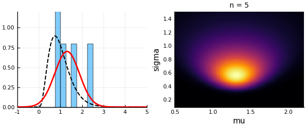
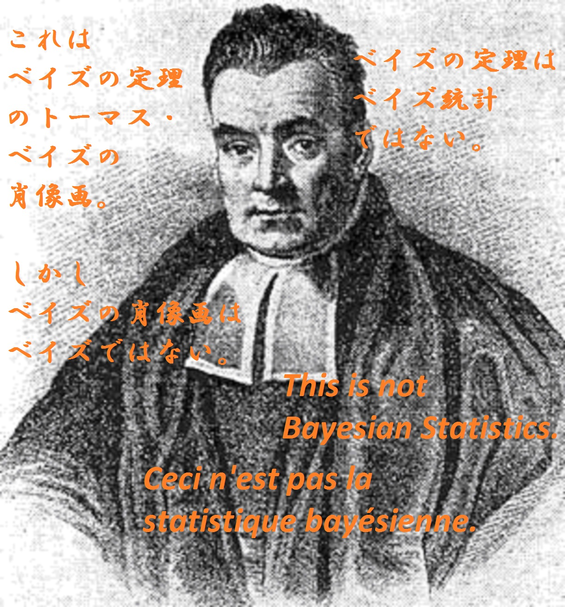

---
jupyter:
  jupytext:
    formats: ipynb,md
    text_representation:
      extension: .md
      format_name: markdown
      format_version: '1.1'
      jupytext_version: 1.2.1
  kernelspec:
    display_name: Julia 1.1.1
    language: julia
    name: julia-1.1
---

<!-- #region {"slideshow": {"slide_type": "slide"}} -->
# ベイズ統計の枠組みと解釈について

黒木玄

2019-09-16～2019-09-26

* 2019年9月17日(火)午後
* 東北大学大学院理学研究科・理学部 青葉山キャンパス
* 合同棟B棟10階1023号室 物理のセミナー

このJupyterノートブックは次の場所で閲覧できる(少々重い):

* [Jupyterノートブックとして閲覧](https://nbviewer.jupyter.org/github/genkuroki/Statistics/blob/master/Introduction%20to%20Bayesian%20Statistics.ipynb)

さらに, RISEのスライドモードでも閲覧可能である:

* [スライドモードで閲覧](https://nbviewer.jupyter.org/format/slides/github/genkuroki/Statistics/blob/master/Introduction%20to%20Bayesian%20Statistics.ipynb#/)

PDF版が以下の場所にある(ただし動画は動かなくなる):

* [ベイズ統計の枠組みと解釈について PDF版](https://genkuroki.github.io/documents/Statistics/Introduction%20to%20Bayesian%20Statistics.pdf)

次の手書きのノートも参照せよ:

* [ベイズ統計に関する手書きのノート PDF](https://genkuroki.github.io/documents/2019-09-03_BayesianStatistics.pdf)

$
\newcommand\eps{\varepsilon}
\newcommand\ds{\displaystyle}
\newcommand\Z{{\mathbb Z}}
\newcommand\R{{\mathbb R}}
\newcommand\C{{\mathbb C}}
\newcommand\QED{\text{□}}
\newcommand\root{\sqrt}
\newcommand\bra{\langle}
\newcommand\ket{\rangle}
\newcommand\d{\partial}
\newcommand\sech{\operatorname{sech}}
\newcommand\cosec{\operatorname{cosec}}
\newcommand\sign{\operatorname{sign}}
\newcommand\sinc{\operatorname{sinc}}
\newcommand\real{\operatorname{Re}}
\newcommand\imag{\operatorname{Im}}
\newcommand\Li{\operatorname{Li}}
\newcommand\PROD{\mathop{\coprod\kern-1.35em\prod}}
$
<!-- #endregion -->

<!-- #region {"slideshow": {"slide_type": "subslide"}} -->
**要約:**

(1) ベイズ統計の数学的枠組みは統計力学と極めて似ている. 分配函数とその対数(の $-1/\beta$ 倍)の自由エネルギーはベイズ統計でも本質的な役割を果たす.  ベイズ統計に逆温度を導入することもできて, 物理的直観がそのまま適用可能である.

(2) 統計学としてのベイズ統計の解釈には混乱の歴史がある. 確率概念に関する混乱があったと言ってもよい.  その混乱は, 数学的モデル内部での確率と現実での確率を明瞭に区別すれば取り除かれる.

初歩的な確率論と統計学の復習から始めて丁寧に議論を進めたい. 

できる限り, 内容を入門的なものに限定し, 技術的に難しい話はしない予定である.

**注意:** 確率密度函数のことを確率分布と呼ぶ用語の濫用を行うので注意せよ.
<!-- #endregion -->

<!-- #region {"slideshow": {"slide_type": "subslide"}, "toc": true} -->
<h1>目次<span class="tocSkip"></span></h1>
<div class="toc"><ul class="toc-item"><li><span><a href="#確率論入門" data-toc-modified-id="確率論入門-1"><span class="toc-item-num">1&nbsp;&nbsp;</span>確率論入門</a></span><ul class="toc-item"><li><span><a href="#三種の神器" data-toc-modified-id="三種の神器-1.1"><span class="toc-item-num">1.1&nbsp;&nbsp;</span>三種の神器</a></span></li><li><span><a href="#3つ目の三種の神器:-Sanovの定理" data-toc-modified-id="3つ目の三種の神器:-Sanovの定理-1.2"><span class="toc-item-num">1.2&nbsp;&nbsp;</span>3つ目の三種の神器: Sanovの定理</a></span></li><li><span><a href="#有限集合上の確率分布に関するSanovの定理の証明" data-toc-modified-id="有限集合上の確率分布に関するSanovの定理の証明-1.3"><span class="toc-item-num">1.3&nbsp;&nbsp;</span>有限集合上の確率分布に関するSanovの定理の証明</a></span></li><li><span><a href="#Sanovの定理の使い方" data-toc-modified-id="Sanovの定理の使い方-1.4"><span class="toc-item-num">1.4&nbsp;&nbsp;</span>Sanovの定理の使い方</a></span></li><li><span><a href="#脱線:-カノニカル分布の導出" data-toc-modified-id="脱線:-カノニカル分布の導出-1.5"><span class="toc-item-num">1.5&nbsp;&nbsp;</span>脱線: カノニカル分布の導出</a></span></li><li><span><a href="#脱線続き:-カノニカル分布の条件付き確率分布としての出現" data-toc-modified-id="脱線続き:-カノニカル分布の条件付き確率分布としての出現-1.6"><span class="toc-item-num">1.6&nbsp;&nbsp;</span>脱線続き: カノニカル分布の条件付き確率分布としての出現</a></span></li></ul></li><li><span><a href="#統計学入門" data-toc-modified-id="統計学入門-2"><span class="toc-item-num">2&nbsp;&nbsp;</span>統計学入門</a></span><ul class="toc-item"><li><span><a href="#統計学の基本問題" data-toc-modified-id="統計学の基本問題-2.1"><span class="toc-item-num">2.1&nbsp;&nbsp;</span>統計学の基本問題</a></span></li><li><span><a href="#パラメトリック統計" data-toc-modified-id="パラメトリック統計-2.2"><span class="toc-item-num">2.2&nbsp;&nbsp;</span>パラメトリック統計</a></span></li><li><span><a href="#尤度" data-toc-modified-id="尤度-2.3"><span class="toc-item-num">2.3&nbsp;&nbsp;</span>尤度</a></span></li><li><span><a href="#尤度(続き)" data-toc-modified-id="尤度(続き)-2.4"><span class="toc-item-num">2.4&nbsp;&nbsp;</span>尤度(続き)</a></span></li><li><span><a href="#尤度(続きの続き)" data-toc-modified-id="尤度(続きの続き)-2.5"><span class="toc-item-num">2.5&nbsp;&nbsp;</span>尤度(続きの続き)</a></span></li><li><span><a href="#笑:-an-information-criterion" data-toc-modified-id="笑:-an-information-criterion-2.6"><span class="toc-item-num">2.6&nbsp;&nbsp;</span>笑: an information criterion</a></span></li><li><span><a href="#最尤法" data-toc-modified-id="最尤法-2.7"><span class="toc-item-num">2.7&nbsp;&nbsp;</span>最尤法</a></span></li><li><span><a href="#例：正規分布モデルによる最尤法" data-toc-modified-id="例：正規分布モデルによる最尤法-2.8"><span class="toc-item-num">2.8&nbsp;&nbsp;</span>例：正規分布モデルによる最尤法</a></span></li><li><span><a href="#最尤法と物理の類似" data-toc-modified-id="最尤法と物理の類似-2.9"><span class="toc-item-num">2.9&nbsp;&nbsp;</span>最尤法と物理の類似</a></span></li><li><span><a href="#尤度函数は推定の収束の様子の情報を持っている" data-toc-modified-id="尤度函数は推定の収束の様子の情報を持っている-2.10"><span class="toc-item-num">2.10&nbsp;&nbsp;</span>尤度函数は推定の収束の様子の情報を持っている</a></span></li><li><span><a href="#例：正規分布モデルの尤度函数" data-toc-modified-id="例：正規分布モデルの尤度函数-2.11"><span class="toc-item-num">2.11&nbsp;&nbsp;</span>例：正規分布モデルの尤度函数</a></span></li><li><span><a href="#例：ガンマ分布モデルの尤度函数" data-toc-modified-id="例：ガンマ分布モデルの尤度函数-2.12"><span class="toc-item-num">2.12&nbsp;&nbsp;</span>例：ガンマ分布モデルの尤度函数</a></span></li></ul></li><li><span><a href="#Bayes統計の定式化" data-toc-modified-id="Bayes統計の定式化-3"><span class="toc-item-num">3&nbsp;&nbsp;</span>Bayes統計の定式化</a></span><ul class="toc-item"><li><span><a href="#Bayes統計の定式化の概略" data-toc-modified-id="Bayes統計の定式化の概略-3.1"><span class="toc-item-num">3.1&nbsp;&nbsp;</span>Bayes統計の定式化の概略</a></span></li><li><span><a href="#Bayes統計の定式化の詳細-(1)-仮想世界の設定" data-toc-modified-id="Bayes統計の定式化の詳細-(1)-仮想世界の設定-3.2"><span class="toc-item-num">3.2&nbsp;&nbsp;</span>Bayes統計の定式化の詳細 (1) 仮想世界の設定</a></span></li><li><span><a href="#Bayes統計の定式化の詳細-(2)-条件付き確率分布を考える" data-toc-modified-id="Bayes統計の定式化の詳細-(2)-条件付き確率分布を考える-3.3"><span class="toc-item-num">3.3&nbsp;&nbsp;</span>Bayes統計の定式化の詳細 (2) 条件付き確率分布を考える</a></span></li><li><span><a href="#Bayes統計の定式化の詳細-(3)-予測分布の定義" data-toc-modified-id="Bayes統計の定式化の詳細-(3)-予測分布の定義-3.4"><span class="toc-item-num">3.4&nbsp;&nbsp;</span>Bayes統計の定式化の詳細 (3) 予測分布の定義</a></span></li><li><span><a href="#Bayesの定理は必須ではない" data-toc-modified-id="Bayesの定理は必須ではない-3.5"><span class="toc-item-num">3.5&nbsp;&nbsp;</span>Bayesの定理は必須ではない</a></span></li><li><span><a href="#笑:-ベイズの定理はベイズ統計ではない" data-toc-modified-id="笑:-ベイズの定理はベイズ統計ではない-3.6"><span class="toc-item-num">3.6&nbsp;&nbsp;</span>笑: ベイズの定理はベイズ統計ではない</a></span></li><li><span><a href="#事後分布" data-toc-modified-id="事後分布-3.7"><span class="toc-item-num">3.7&nbsp;&nbsp;</span>事後分布</a></span></li><li><span><a href="#おすすめのベイズ統計入門" data-toc-modified-id="おすすめのベイズ統計入門-3.8"><span class="toc-item-num">3.8&nbsp;&nbsp;</span>おすすめのベイズ統計入門</a></span></li></ul></li><li><span><a href="#主観確率・意思決定論によるベイズ統計の解釈に対する批判" data-toc-modified-id="主観確率・意思決定論によるベイズ統計の解釈に対する批判-4"><span class="toc-item-num">4&nbsp;&nbsp;</span>主観確率・意思決定論によるベイズ統計の解釈に対する批判</a></span><ul class="toc-item"><li><span><a href="#予測分布の最適性による特徴付け" data-toc-modified-id="予測分布の最適性による特徴付け-4.1"><span class="toc-item-num">4.1&nbsp;&nbsp;</span>予測分布の最適性による特徴付け</a></span></li><li><span><a href="#特徴付けの証明の概略" data-toc-modified-id="特徴付けの証明の概略-4.2"><span class="toc-item-num">4.2&nbsp;&nbsp;</span>特徴付けの証明の概略</a></span></li><li><span><a href="#補足:-汎函数微分の計算の仕方" data-toc-modified-id="補足:-汎函数微分の計算の仕方-4.3"><span class="toc-item-num">4.3&nbsp;&nbsp;</span>補足: 汎函数微分の計算の仕方</a></span></li><li><span><a href="#以上のまとめ" data-toc-modified-id="以上のまとめ-4.4"><span class="toc-item-num">4.4&nbsp;&nbsp;</span>以上のまとめ</a></span></li><li><span><a href="#数学的モデル内での平均二乗誤差が最小になるパラメーターの推定値" data-toc-modified-id="数学的モデル内での平均二乗誤差が最小になるパラメーターの推定値-4.5"><span class="toc-item-num">4.5&nbsp;&nbsp;</span>数学的モデル内での平均二乗誤差が最小になるパラメーターの推定値</a></span></li><li><span><a href="#汎函数微分やLagrangeの未定乗数法を使わない直接的証明" data-toc-modified-id="汎函数微分やLagrangeの未定乗数法を使わない直接的証明-4.6"><span class="toc-item-num">4.6&nbsp;&nbsp;</span>汎函数微分やLagrangeの未定乗数法を使わない直接的証明</a></span><ul class="toc-item"><li><span><a href="#平均二乗誤差を最小にする推定の場合" data-toc-modified-id="平均二乗誤差を最小にする推定の場合-4.6.1"><span class="toc-item-num">4.6.1&nbsp;&nbsp;</span>平均二乗誤差を最小にする推定の場合</a></span></li><li><span><a href="#平均汎化誤差を最小にする分布の場合" data-toc-modified-id="平均汎化誤差を最小にする分布の場合-4.6.2"><span class="toc-item-num">4.6.2&nbsp;&nbsp;</span>平均汎化誤差を最小にする分布の場合</a></span></li></ul></li><li><span><a href="#「主観確率」「意思決定論」によるベイズ統計の解釈に対する批判" data-toc-modified-id="「主観確率」「意思決定論」によるベイズ統計の解釈に対する批判-4.7"><span class="toc-item-num">4.7&nbsp;&nbsp;</span>「主観確率」「意思決定論」によるベイズ統計の解釈に対する批判</a></span></li><li><span><a href="#数学的モデル自体のデータによる評価に向けて" data-toc-modified-id="数学的モデル自体のデータによる評価に向けて-4.8"><span class="toc-item-num">4.8&nbsp;&nbsp;</span>数学的モデル自体のデータによる評価に向けて</a></span></li></ul></li><li><span><a href="#Bayes統計の情報量規準" data-toc-modified-id="Bayes統計の情報量規準-5"><span class="toc-item-num">5&nbsp;&nbsp;</span>Bayes統計の情報量規準</a></span><ul class="toc-item"><li><span><a href="#Bayes統計における2種類の汎化誤差" data-toc-modified-id="Bayes統計における2種類の汎化誤差-5.1"><span class="toc-item-num">5.1&nbsp;&nbsp;</span>Bayes統計における2種類の汎化誤差</a></span></li><li><span><a href="#(1)型情報量規準:-自由エネルギー" data-toc-modified-id="(1)型情報量規準:-自由エネルギー-5.2"><span class="toc-item-num">5.2&nbsp;&nbsp;</span>(1)型情報量規準: 自由エネルギー</a></span><ul class="toc-item"><li><span><a href="#自由エネルギーと(1)型汎化誤差の関係" data-toc-modified-id="自由エネルギーと(1)型汎化誤差の関係-5.2.1"><span class="toc-item-num">5.2.1&nbsp;&nbsp;</span>自由エネルギーと(1)型汎化誤差の関係</a></span></li><li><span><a href="#自由エネルギーの漸近挙動" data-toc-modified-id="自由エネルギーの漸近挙動-5.2.2"><span class="toc-item-num">5.2.2&nbsp;&nbsp;</span>自由エネルギーの漸近挙動</a></span></li><li><span><a href="#自由エネルギーは情報量規準として利用可能" data-toc-modified-id="自由エネルギーは情報量規準として利用可能-5.2.3"><span class="toc-item-num">5.2.3&nbsp;&nbsp;</span>自由エネルギーは情報量規準として利用可能</a></span></li><li><span><a href="#正則モデルの場合" data-toc-modified-id="正則モデルの場合-5.2.4"><span class="toc-item-num">5.2.4&nbsp;&nbsp;</span>正則モデルの場合</a></span></li><li><span><a href="#自由エネルギーに関する結論" data-toc-modified-id="自由エネルギーに関する結論-5.2.5"><span class="toc-item-num">5.2.5&nbsp;&nbsp;</span>自由エネルギーに関する結論</a></span></li><li><span><a href="#自由エネルギーの漸近挙動の証明法" data-toc-modified-id="自由エネルギーの漸近挙動の証明法-5.2.6"><span class="toc-item-num">5.2.6&nbsp;&nbsp;</span>自由エネルギーの漸近挙動の証明法</a></span></li></ul></li><li><span><a href="#(2)型情報量規準:-予測分布の汎化誤差の推定量" data-toc-modified-id="(2)型情報量規準:-予測分布の汎化誤差の推定量-5.3"><span class="toc-item-num">5.3&nbsp;&nbsp;</span>(2)型情報量規準: 予測分布の汎化誤差の推定量</a></span><ul class="toc-item"><li><span><a href="#学習誤差と過学習の定義" data-toc-modified-id="学習誤差と過学習の定義-5.3.1"><span class="toc-item-num">5.3.1&nbsp;&nbsp;</span>学習誤差と過学習の定義</a></span></li><li><span><a href="#汎函数分散の定義" data-toc-modified-id="汎函数分散の定義-5.3.2"><span class="toc-item-num">5.3.2&nbsp;&nbsp;</span>汎函数分散の定義</a></span></li><li><span><a href="#WAIC-(widely-applicable-information-criterion)" data-toc-modified-id="WAIC-(widely-applicable-information-criterion)-5.3.3"><span class="toc-item-num">5.3.3&nbsp;&nbsp;</span>WAIC (widely applicable information criterion)</a></span></li><li><span><a href="#LOOCV-(leave-one-out-cross-varidation,-1個抜き出し交差検証)" data-toc-modified-id="LOOCV-(leave-one-out-cross-varidation,-1個抜き出し交差検証)-5.3.4"><span class="toc-item-num">5.3.4&nbsp;&nbsp;</span>LOOCV (leave-one-out cross varidation, 1個抜き出し交差検証)</a></span></li><li><span><a href="#(2)型情報量規準と汎化誤差の逆相関" data-toc-modified-id="(2)型情報量規準と汎化誤差の逆相関-5.3.5"><span class="toc-item-num">5.3.5&nbsp;&nbsp;</span>(2)型情報量規準と汎化誤差の逆相関</a></span></li></ul></li></ul></li><li><span><a href="#Bayes統計の計算例" data-toc-modified-id="Bayes統計の計算例-6"><span class="toc-item-num">6&nbsp;&nbsp;</span>Bayes統計の計算例</a></span></li></ul></div>
<!-- #endregion -->

```julia slideshow={"slide_type": "subslide"}
using Base64
displayfile(mime, file; tag="img") = open(file) do f
    display("text/html", """<$tag src="data:$mime;base64,$(base64encode(f))">""")
end

using Distributions
using Statistics
using StatsBase

using StatsPlots
using Plots
default(size=(400, 250), titlefontsize=10)
pyplot(fmt=:svg)
PyPlot_clf() = if backend() == Plots.PyPlotBackend() PyPlot.clf() end

using Random
using QuadGK
using SpecialFunctions
```

<!-- #region {"slideshow": {"slide_type": "slide"}} -->
## 確率論入門
<!-- #endregion -->

<!-- #region {"slideshow": {"slide_type": "-"}} -->
### 三種の神器

平均と有限の分散を持つ確率分布 $p(x)$ が任意に与えられていて, $X_1,X_2,X_3,\ldots$ は各々の確率分布が $p(x)$ であるような独立同分布確率変数列 (independent and identically distributed, i.i.d.)であるとする(例: サイコロの目の列). 

このとき, $X_1,X_2,\ldots,X_n$ を**母集団分布** $p(x)$ のサイズ $n$ の**サンプル**と呼ぶ.

$\mu = E[X_k]$, $\sigma^2 = E[(X_k - \mu)^2]$ とおく. 

(1) 大数の法則: $\ds \frac{X_1+\cdots+X_n}{n} \to \mu$.

(2) 中心極限定理: $\mu=0$, $\sigma=1$ と仮定する. このとき,

$$
E\left[f\left(\frac{X_1+\cdots+X_n}{\sqrt{n}}\right)\right] \to \int_\R f(x)\frac{e^{-x^2/2}}{\sqrt{2\pi}}\,dx
$$

**注意:** $Y_k = (X_k-\mu)/\sigma$ とおくと, $Y_k$ は平均 $0$, 分散 $1$ になる.  $\QED$
<!-- #endregion -->

<!-- #region {"slideshow": {"slide_type": "subslide"}} -->
### 3つ目の三種の神器: Sanovの定理

**(3) Sanovの定理:** 確率分布 $q(x)$ について, 

($X_1,X_2,\ldots,X_n$ が確率分布 $q(x)$ のサンプルに見える確率) $= \exp(-nD(q||p)+o(n))$.

ただし, $D(q||p)$ は**Kullback-Leibler情報量**である:

$$
D(q||p) = \int q(x)\log\frac{q(x)}{p(x)}\,dx = G(q||p) - S(q).
$$

ここで

$$
G(q||p) = \int q(x)(-\log p(x))\,dx, \quad S(q) = G(q||q)
$$

はそれぞれ予測分布 $p(x)$ による分布 $q(x)$ の予測の**汎化誤差** (generalization error)と呼ばれ, $S(q)$ は分布 $q$ の**Shannon情報量**と呼ばれる.
<!-- #endregion -->

<!-- #region {"slideshow": {"slide_type": "subslide"}} -->
**Sanovの定理の意味:** 確率分布 $p(x)$ に従う乱数列 $X_1,X_2,\ldots,X_n$ で確率分布 $q(x)$ のシミュレーションを行うとき, そのシミュレーションが $q(x)$ からずれていることが明瞭にならずに済む確率が $n$ について指数函数的に減少し, その減少の速さがKullback-Leibler情報量になっている.  $\QED$

これは, KL情報量 $D(q||p)$ を分布 $p$ による分布 $q$ のシミュレーションの**予測誤差**とみなせることを意味している. 

函数 $x\log x$ にJensenの不等式を適用することによって, KL情報量の正値性 $D(q||p)\geqq 0$ を容易に証明でき, その他にも多くの良い性質が知られている.
<!-- #endregion -->

<!-- #region {"slideshow": {"slide_type": "subslide"}} -->
大数の法則と中心極限定理については以下のリンク先を参照せよ:

* [確率論入門](https://genkuroki.github.io/documents/IntroProbability.pdf)

Sanovの定理については以下のリンク先を参照せよ:

* [Kullback-Leibler情報量と記述統計](https://nbviewer.jupyter.org/github/genkuroki/Statistics/blob/master/KL%20information%20and%20descriptive%20statistics.ipynb)

* [Kullback-Leibler情報量とSanovの定理](https://genkuroki.github.io/documents/20160616KullbackLeibler.pdf)
<!-- #endregion -->

<!-- #region {"slideshow": {"slide_type": "subslide"}} -->
**情報量とエントロピー:**

(1) KL情報量 $D(q||p)$ の $-1$ 倍は**相対エントロピー**と呼ばれることがある.

(2) KL情報量最小化は相対エントロピー最大化と同じ.

(3) 大雑把に言って, **log(確率)＝(エントロピー)＝－(情報量)** と考えるとよい.

(4) 汎化誤差の定義は, 確率密度の対数の $-1$ 倍 $-\log p(x)$ の分布 $q(x)$ に関する平均なので, **分布 $q(x)$ における分布 $p(x)$ の平均情報量**というようなものになっていることになる.   $\QED$
<!-- #endregion -->

<!-- #region {"slideshow": {"slide_type": "subslide"}} -->
### 有限集合上の確率分布に関するSanovの定理の証明

確率 $p_i$ で $i=1,2,\ldots,r$ の目が出るサイコロを考える.  $q_i$ は集合 $\{1,2,\ldots,r\}$ 上の任意の確率分布であるとする($0$ 以上で総和が $1$).

このとき, $n$ 回サイコロをふって $i=1,2,\ldots,n$ の目が $k_i$ 回出る確率は多項分布の確率

$$
\frac{n!}{k_1!\cdots k_r!}p_1^{k_1}\cdots p_r^{k_r}
$$

になる. そのような出目がまるで確率分布 $q_i$ に従っているように見えることは $k_i \approx nq_i$ が成立することだと解釈される. そこで, 多項分布の確率の式の $k_i$ に $nq_i$ を代入して, さらに階乗にStirlingの近似公式を適用すると, 上の確率は次のように書き直される:

$$
\frac{1}{\sqrt{(2\pi)^{r-1}q_1\cdots q_r}}\exp\left(-n\sum_{i=1}^r q_i\log\frac{p_i}{q_i}\right) =
\exp\left(-n\sum_{i=1}^r q_i\log\frac{p_i}{q_i} + o(n)\right).
$$

これで有限集合上の確率分布に関するSanovの定理を証明できたことになる. 

一般の場合はこれの「連続極限」として得られると考えてもよい.
<!-- #endregion -->

<!-- #region {"slideshow": {"slide_type": "subslide"}} -->
### Sanovの定理の使い方

Sanovの定理によって, KL情報量 $D(q||p)$ はモデルの分布 $p$ による分布 $q$ のシミュレーションにおける**予測誤差**とみなせるのであった.  ゆえに, ある特定の確率分布の集合の中から分布 $q$ を最もよくシミュレートする分布を見付けるためには, KL情報量を最小化する分布 $p$ をその特定の集合の中で見付ければよい.
<!-- #endregion -->

<!-- #region {"slideshow": {"slide_type": "subslide"}} -->
さらに, KL情報量 $D(q||p)$ は汎化誤差 $G(q||p)$ とShannon情報量 $S(q)$ の差に等しいのであった:

$$
\begin{aligned}
&
D(q||p) = G(q||p) - S(q),
\\ &
G(q||p) = \int q(x)(-\log p(x))\,dx, 
\\ &
S(q) = G(q||q).
\end{aligned}
$$

$S(q)$ は $p$ によらないので, 予測誤差を最小化するためには $p$ を適当に動かして**汎化誤差** $G(q||p)$ を最小化すればよい. 

統計学の状況ではKL情報量を直接近似している推定量を作ることは困難だが, 汎化誤差の方であればそれを近似していると期待される推定量を作ることができる.  だから, **予測誤差を小さくするためには汎化誤差を小さくすれば十分である**ことは実用上において重要な注意だということになる.
<!-- #endregion -->

<!-- #region {"slideshow": {"slide_type": "subslide"}} -->
### 脱線: カノニカル分布の導出

固定された分布 $p(x)$ に対して, 

$$
\int q(x) f_i(x)\,dx = c_i\quad (i=1,2,\ldots,r)
\tag{$*$}
$$

を満たす分布 $q(x)$ でKL情報量 $D(q||p)$ を最小にするものをLagrange未定乗数法で計算すると

$$
q(x) = \frac{1}{Z}\exp\left(-\sum_{i=1}^r \beta_i f_i(x)\right)p(x), \quad 
Z = \int \exp\left(-\sum_{i=1}^r \beta_i f_i(x)\right)p(x)\,dx
$$

がその解であることがわかる. ただし, $\beta_i$ 達は上の条件($*$)で決まるものとする.
<!-- #endregion -->

<!-- #region {"slideshow": {"slide_type": "subslide"}} -->
**注意:** 統計力学の教科書におけるカノニカル分布の導出の方が, 事前分布 $p(x)$ 入りの場合を扱っていることを除けば, KL情報量を用いたカノニカル分布の導出よりも一般的である.  以上に関するより詳しい解説が『[Kullback-Leibler情報量とSanovの定理](https://genkuroki.github.io/documents/20160616KullbackLeibler.pdf)』にある.  $\QED$
<!-- #endregion -->

<!-- #region {"slideshow": {"slide_type": "subslide"}} -->
### 脱線続き: カノニカル分布の条件付き確率分布としての出現

事前分布 $p(x)$ を母集団分布とするときのサンプル $X_1,X_2,\ldots,X_n$ の分布を

$$
\frac{1}{n}\sum_{k=1}^n f(X_k) = c_i\quad (i=1,2,\ldots,r)
\tag{$\sharp$}
$$

という条件で制限した条件付き確率分布における代表 $X_1$ の分布は $n\to\infty$ の極限は次のカノニカル分布に収束する:

$$
q(x) = \frac{1}{Z}\exp\left(-\sum_{i=1}^r \beta_i f_i(x)\right)p(x), \quad 
Z = \int \exp\left(-\sum_{i=1}^r \beta_i f_i(x)\right)p(x)\,dx.
$$

ただし, $\beta_i$ 達は前節の条件($*$)で決まるものとする. 条件($*$)の再掲:

$$
\int q(x) f_i(x)\,dx = c_i\quad (i=1,2,\ldots,r)
\tag{$*$}
$$

実際には条件($\sharp$)は適切な向きの不等式で与えることになる.  以上の説明はその点が厳密ではない. しかし, $n\to\infty$ で不等式で定義された条件付き確率分布は等式の条件($\sharp$)を満たす場合の近くに集中して行くので, 以上の厳密でない説明に大きな間違いはない. 
<!-- #endregion -->

<!-- #region {"slideshow": {"slide_type": "subslide"}} -->
以上に関するより詳しい解説も『[Kullback-Leibler情報量とSanovの定理](https://genkuroki.github.io/documents/20160616KullbackLeibler.pdf)』にある.  そのノートに書いてある解説は英語で検索してもなかなか見付からないので, もしかしたら貴重な解説になっているかもしれない.
<!-- #endregion -->

<!-- #region {"slideshow": {"slide_type": "slide"}} -->
## 統計学入門
<!-- #endregion -->

<!-- #region {"slideshow": {"slide_type": "-"}} -->
### 統計学の基本問題

以下では, $X_1,X_2,\ldots,X_n$ は未知の母集団分布 $q(x)$ のサンプル(i.i.d.)であると仮定する.

**基本問題: サンプル $X_1,X_2,\ldots,X_n$ のみから母集団分布 $q(x)$ についてどれだけどのように推測できるか?**  $\QED$
<!-- #endregion -->

<!-- #region {"slideshow": {"slide_type": "subslide"}} -->
**例:** 未知の母集団分布 $q(x)$ のサイズ $n=50$ のサンプル

    1.1, 1.45, 0.93, 2.01, 0.13, 1.78, 1.07, 0.75, 0.48, 0.64, 
    0.81, 1.13, 0.89, 1.39, 0.69, 0.57, 3.22, 1.18, 2.03, 0.85, 
    1.08, 0.96, 1.1, 0.81, 1.19, 1.09, 1.51, 1.01, 0.54, 0.84, 
    1.06, 0.33, 1.14, 0.67, 1.57, 0.88, 0.48, 0.78, 0.38, 0.82, 
    0.53, 0.52, 1.18, 0.67, 2.01, 1.14, 0.71, 0.69, 1.24, 0.72

が得られたとする. このサンプルのヒストグラムは以下の通り.
<!-- #endregion -->

```julia slideshow={"slide_type": "subslide"}
X = [1.1, 1.45, 0.93, 2.01, 0.13, 1.78, 1.07, 0.75, 0.48, 0.64, 0.81, 1.13, 0.89, 1.39, 0.69, 0.57, 3.22, 1.18, 2.03, 0.85, 1.08, 0.96, 1.1, 0.81, 1.19, 1.09, 1.51, 1.01, 0.54, 0.84, 1.06, 0.33, 1.14, 0.67, 1.57, 0.88, 0.48, 0.78, 0.38, 0.82, 0.53, 0.52, 1.18, 0.67, 2.01, 1.14, 0.71, 0.69, 1.24, 0.72]
histogram(X; bins=range(0, 3.3, step=0.1), alpha=0.5, label="sample")
```

<!-- #region {"slideshow": {"slide_type": "subslide"}} -->
実はこれはパラメーター $(\alpha,\theta)=(4, 1/4)$ のガンマ分布を母集団分布とするサンプルをコンピューターの擬似乱数で生成したものである(ただし小数点以下2桁までに丸めた).  

その母集団分布の平均と分散はそれぞれ $1$, $0.25$ になる(標準偏差は $0.5$).

上のサンプルの平均と分散(不偏分散ではなく単なる分散)はそれぞれ 1.015, 0.276 程度になる. 上のヒストグラムを見れば, この母集団分布はそれらを平均と分散とする正規分布で近似されるのではないだろうかと思う人がいても不思議ではないと思われる. 上のヒストグラムとその正規分布を重ねてプロットしてみよう.
<!-- #endregion -->

```julia
function fit_mle_and_plot(X, model, model_str; x = range(0, 3.3, length=200))
    dist_mle = fit_mle(model, X)
    f(x) = pdf(dist_mle, x)
    AIC = -2sum(logpdf.(dist_mle, X)) + 2length(params(dist_mle))
    histogram(X; bins=range(0, 3.3, step=0.1), alpha=0.5, ylim=(0, 1.7), label="sample", norm=true)
    plot!(x, pdf.(Gamma(4, 0.25), x), label="true population dist", lw=1.5, ls=:dash, color=:black)
    plot!(x, f.(x), label="$model_str dist approx", lw=2, color=:red)
    title!("$model_str dist model: AIC = $(round(AIC, digits=2))")
end
```

```julia
fit_mle_and_plot(X, Normal, "normal"; x = range(-0.3, 3.3, length=200))
```

<!-- #region {"slideshow": {"slide_type": "-"}} -->
別の人は「この分布は正値なので対数正規分布に違いない」と思うかもしれない. 

その人は次のようなプロットを作成するだろう.
<!-- #endregion -->

```julia
fit_mle_and_plot(X, LogNormal, "log normal"; x = range(0, 3.3, length=200))
```

<!-- #region {"slideshow": {"slide_type": "-"}} -->
対数正規分布だと思った人は正規分布だと思った人よりはずっと正確な予測分布を得ている.

しかし, 実際には真の母集団分布はガンマ分布である. 

ある人が特別な神眼によって「これはガンマ分布だ！」と見抜いたとしよう. その人は次のようにプロットするだろう.
<!-- #endregion -->

```julia
fit_mle_and_plot(X, Gamma, "Gamma"; x = range(0, 3.3, length=200))
```

<!-- #region {"slideshow": {"slide_type": "-"}} -->
さすが神眼！ 予測分布(赤線)と真の母集団分布(黒の点線)がぴったり一致している！(笑)

現実にはこのような神眼をはっきできることはまれであり, 真の母集団分布は名前が付けられていないわけのわからない分布かもしれない.

母集団分布 $q(x)$ が未知の状況でその有限サイズのサンプルが得られているときに, 母集団分布を推測することは困難でかつ非常に面白い問題になっていることがよくある. 
<!-- #endregion -->

<!-- #region {"slideshow": {"slide_type": "subslide"}} -->
### パラメトリック統計

未知の母集団分布 $q(x)$ を有限個のパラメーター $w=(w_1,\ldots,w_d)$ を持つ確率分布 $p(x|w)$ を使って推測する状況を**パラメトリックの場合**と呼ぶ.  

**以下では簡単のためパラメトリック統計の場合のみを扱う.**
<!-- #endregion -->

<!-- #region {"slideshow": {"slide_type": "subslide"}} -->
$p(x|w)$ の形の分布で $q(x)$ を最もよくシミュレートするものは, 汎化誤差

$$
G(w) = G(q||p(\cdot|w)) = \int q(x)(-\log p(x|w))\,dx
$$

を最小化する $w=w_0$ に対する $p_0(x)=p(x|w_0)$ になる.

**(以下ではずっと, 記号 $w_0$ をこの意味で用いる.)**

しかし, 汎化誤差は未知の母集団分布 $q(x)$ を使って計算される量なので, 汎化誤差を直接最小化することは不可能である.
<!-- #endregion -->

<!-- #region {"slideshow": {"slide_type": "subslide"}} -->
### 尤度

**尤度**は「いぬど」と読む.
<!-- #endregion -->

<!-- #region {"slideshow": {"slide_type": "subslide"}} -->
### 尤度(続き)

**尤度**は「いぬど」と読むというのは, もちろんウソである.

**尤度**は「ゆうど」と読む. 英語では likelihood で意味的には「もっともらしさ」である.

しかし, 実際には後述するようにモデルのサンプルへの確率的な適合度だとみなす方が正しい.
<!-- #endregion -->

<!-- #region {"slideshow": {"slide_type": "subslide"}} -->
### 尤度(続きの続き)

$X_1,X_2,\ldots,X_n$ は未知の母集団分布 $q(x)$ のサンプル(i.i.d.)であった. すなわち, $(X_1,\ldots,X_n)$ の分布は確率密度函数

$$
(x_1,\ldots,x_n) \mapsto q(x_1)\cdots q(x_n)
$$

を持つ. パラメーター $w$ の函数

$$
w\mapsto p(X_1|w)p_2(X_2|w)\cdots p(X_n|w)
$$

をサンプル $X_1,\ldots,X_n$ に関するモデル $p(x|w)$ の**尤度** (ゆうど, 尤もらしさ, likelihood) の函数と呼ばれる.

仮にモデル $p(x|w)$ がサンプルを生成した母集団分布であるならば, サンプルの分布の確率密度函数は

$$
(x_1,\ldots,x_n) \mapsto p(x_1|w)\cdots p(x_n|w)
$$

になる. ゆえに, 尤度は「もっともらしさ」を意味するとよく説明されているが, 実際には単に

* モデル $p(x|w)$ にしたがう独立試行で偶然にサンプル $X_1,\ldots,X_n$ が生成される確率(密度)

に過ぎないことがわかる.  すなわち, 尤度はモデルのサンプルへの確率的な適合度を意味しているとみなされる. 

我々が欲しいのはサンプルに適合した分布ではなく, 未知の母集団分布に適合した分布であるので, この注意は重要である(**過学習**の問題).

尤度の概念に関する詳しい説明については以下の2つの論説を参照せよ:

* 赤池弘次, [統計的推論のパラダイムの変遷について](https://ismrepo.ism.ac.jp/?action=pages_view_main&active_action=repository_view_main_item_detail&item_id=32568&item_no=1&page_id=13&block_id=21), 	統計数理研究所彙報, 第27巻1号, pp.5-12, 1980-03

* 赤池弘次, [エントロピーとモデルの尤度(〈講座〉物理学周辺の確率統計)](https://www.jstage.jst.go.jp/article/butsuri1946/35/7/35_7_608/_article/-char/ja/), 日本物理学会誌, 1980年35巻7号, pp.608-614
<!-- #endregion -->

<!-- #region {"slideshow": {"slide_type": "subslide"}} -->
### 笑: an information criterion

以下の画像は

* 赤池弘次, [エントロピーとモデルの尤度(〈講座〉物理学周辺の確率統計)](https://www.jstage.jst.go.jp/article/butsuri1946/35/7/35_7_608/_article/-char/ja/), 日本物理学会誌, 1980年35巻7号, pp.608-614

より:


<!-- #endregion -->

<!-- #region {"slideshow": {"slide_type": "subslide"}} -->
### 最尤法

大数の法則より, 尤度函数の対数の $-1/n$ 倍 $L_n(w)$ は $n\to\infty$ でモデル $p(x|w)$ の汎化誤差 $G(w)$ に収束する:

$$
L_n(w) = \frac{1}{n}\sum_{k=1}^n (-\log p(X_k|w)) \to G(w) = \int q(x)(-\log p(x|w))\,dx.
$$

すなわち, 尤度函数の対数の $-1/n$ 倍 $L_n(w)$ は汎化誤差 $G(w)$ の一致推定量になっている.

我々が欲しいのは汎化誤差を最小化する $w=w_0$ であるが, その代わりに $L_n(w)$ を最小化すること(＝尤度函数の最大化)によってパラメーター $w=\hat{w}$ を決めて, 予測分布を $p(x|\hat{w})$ とする手続きを最尤法と呼ぶ.
<!-- #endregion -->

<!-- #region {"slideshow": {"slide_type": "subslide"}} -->
### 例：正規分布モデルによる最尤法

モデル $p(x|w)$ が以下の正規分布モデルの場合を考える:

$$
p(x|\mu,\sigma^2) = \frac{1}{\sqrt{2\pi\sigma^2}}e^{-(x-\mu)^2/(2\sigma^2)}.
$$

このとき, 母集団分布 $q(x)$ の平均と分散をそれぞれ $\mu_0$, $\sigma_0^2$ と書き, サンプル $X_1,\ldots,X_n$ の平均と分散をそれぞれ $\overline{X}$, $S^2$ と書く:

$$
\begin{aligned}
&
\mu_0 = \int q(x)x\,dx, 
\\ &
\sigma_0^2 = \int q(x)(x-\mu_0)^2\,dx = \int q(x)x^2\,dx - \mu_0^2,
\\ &
\overline{X} = \frac{1}{n}\sum_{k=1}^n X_k, 
\\ &
S^2 = \frac{1}{n}\sum_{k=1}^n (X_k-\overline{X})^2 = \frac{1}{n}\sum_{k=1}^n X_k^2 - \overline{X}^2.
\end{aligned}
$$

このとき, 汎化誤差と対数尤度函数の $-1/n$ 倍はそれぞれ以下のように計算される(大学1年生レベル):

$$
\begin{aligned}
&
2 G(\mu,\sigma) = 
\log(2\pi) + \log\sigma^2 + \frac{\sigma_0^2 + (\mu-\mu_0)^2}{\sigma^2}, 
\\ &
2 L_n(\mu,\sigma) = 
\log(2\pi) + \log\sigma^2 + \frac{S^2+(\mu - \overline{X})^2}{\sigma^2}.
\end{aligned}
$$

ゆえに, 

* 汎化誤差 $G(\mu,\sigma^2)$ を最小化することは $(\mu, \sigma^2)=(\mu_0, \sigma_0^2)$ (正規分布モデルの平均と分散が母集団分布のそれらに等しくなること)と同値である. 

* 尤度函数の対数の $-1/n$ 倍 $L_n(\mu,\sigma^2)$ を最小化すること(＝尤度を最大化すること)は $(\mu, \sigma^2)=(\overline{X}, S^2)$ (正規分布モデルの平均と分散がサンプルのそれらに等しくなること)と同値である.

このように, 正規分布の中で分布 $q(x)$ を最もよく予測するものは, 分布 $q(x)$ と同じ平均と分散を持つ正規分布になる.

さらに, 正規分布モデルの最尤法はサンプルの平均と分散を計算する記述統計と本質的に同じである.

さらに大数の法則より, $n\to\infty$ のとき, $\overline{X}\to\mu_0$, $S^2\to\sigma_0^2$ となるので, サンプルサイズ $n$ を大きくする極限で最尤法の予測分布は正規分布の中で分布 $q(x)$ をもっともよく予測するものに収束してくれる.

**このように平均と分散の統計学は正規分布モデルの統計学だと言ってよい.**
<!-- #endregion -->

<!-- #region {"slideshow": {"slide_type": "subslide"}} -->
他の例が『[Kullback-Leibler情報量と記述統計](https://nbviewer.jupyter.org/github/genkuroki/Statistics/blob/master/KL%20information%20and%20descriptive%20statistics.ipynb)』にある. 

例えば, Laplace分布モデルの最尤法がサンプルの中央値と中央値まで距離の平均の記述統計と本質的に同じことを示せる.  

このように, **簡単なモデル(指数型分布族)の最尤法は本質的にサンプルの記述統計を行っているとみなされる(十分統計量の理論).**
<!-- #endregion -->

<!-- #region {"slideshow": {"slide_type": "subslide"}} -->
### 最尤法と物理の類似

最尤法は対数尤度函数の $-1/n$ 倍

$$
L_n(w) = \frac{1}{n}\sum_{k=1}^n (-\log p(X_k|w))
$$

の最小化によってモデルのパラメーターを決定する方法であった. 

対数尤度函数の $-1$ 倍 $n L_n(w)$ は物理における**Hamiltonian**の類似物であり, 最尤法の解 $w=\hat{w}$ は**基底状態**の類似物だとみなせる.

ただし, 対数尤度函数の $-1$ 倍 $n L_n(w)$ の中には母集団分布に従う確率変数達 $X_k$ が含まれており, **ランダムに決まるHamiltonian**とみなさなければいけない.

さらに統計学では $n\to\infty$ で推定値が最良値に近付いて欲しいという要求がある. 統計学では $n\to\infty$ における各種統計量の漸近挙動を調べることを**漸近論**と呼ぶ. 

これの物理的類似は, 自由度 $n$ のランダムな系とカップルしているせいで確率的に揺らいでいるHamiltonianが $n\to\infty$ でどのように振る舞うかを考えることである.
<!-- #endregion -->

<!-- #region {"slideshow": {"slide_type": "subslide"}} -->
統計学における対数尤度函数の $-1$ 倍をランダムHamiltonianとみなす見方は大変有効であり, Bayes統計は対数尤度函数の $-1$ 倍 $n L_n(w)$ をHamiltonianとするカノニカル分布の統計力学と本質的に同じものであることが(Bayes統計の定義を知っていれば)簡単に分かる.  

Bayes統計における事前分布 $\varphi(w)$ と逆温度 $\beta$ に対する分配函数が次のように定義される:

$$
Z_n(\beta) = \int \exp(-\beta n L_n(w))\varphi(w)\,dw.
$$

Bayes統計では物理的な**等確率の原理を仮定しない**ので事前分布 $\varphi(w)$ の自由度が発生する.  通常のBeyes統計は逆温度が $\beta=1$ の場合に相当する.
<!-- #endregion -->

<!-- #region {"slideshow": {"slide_type": "subslide"}} -->
### 尤度函数は推定の収束の様子の情報を持っている

最尤法が有効に使える場合には, サンプルサイズを大きくすると, 尤度函数

$$
\prod_{k=1}^n p(X_k|w) = \exp(-nL_n(w))
$$

のグラフが漸近的に単峰型になり, サンプルサイズを大きくするにつれて尤度函数の山型のグラフの裾野のサイズが小さくなって行くことが知られている.  山型の尤度函数のグラフの台の小ささは「推定の収束し具合」を表していると解釈できる.
<!-- #endregion -->

<!-- #region {"slideshow": {"slide_type": "subslide"}} -->
最尤法では, 尤度函数を最大化するパラメーターの値(基底状態)の情報だけを残して, 尤度函数が持っている推定の収束し具合の情報をすべて捨ててしまう.  だから, 最尤法を使う場合には推定の収束のし具合の情報も示すために, 信頼区間などを別に計算して示すことが多い.  これは結構煩雑である.

物理的にも, 基底状態の情報だけを残して, ランダムHamiltonian $nL_n(w)$ 全体の情報を捨ててしまうのは不自然過ぎる.

このような不自然さを解消するためにも, ランダムHamiltonian $nL_n(w)$ に関する統計力学(＝Bayes統計)を考えることは自然であると考えられる.
<!-- #endregion -->

<!-- #region {"slideshow": {"slide_type": "subslide"}} -->
### 例：正規分布モデルの尤度函数

次の例は『[Kullback-Leibler情報量と記述統計](https://nbviewer.jupyter.org/github/genkuroki/Statistics/blob/master/KL%20information%20and%20descriptive%20statistics.ipynb)
』より.
<!-- #endregion -->

```julia slideshow={"slide_type": "-"}
# 尤度函数のプロット

Random.seed!(37346491)

dist_gamma = Gamma(4.0, 0.25)
N = 200
XX = rand(dist_gamma, N)

ns = [5;5;5;5;5; 5:10; 12:2:20; 25:5:N; N;N;N;N;N]
@time anim = @animate for n in ns
    X = @view XX[1:n]
    x = range(-1, 5, length=200)

    dist_normal_approx_gamma = fit_mle(Normal, X)
    P1 = histogram(X; normed=true, bins=range(0, 5, step=0.25), alpha=0.5, label="sample")
    plot!(x, pdf.(dist_gamma, x); label="true dist", lw=1.5, ls=:dash, color=:black)
    plot!(x, pdf.(dist_normal_approx_gamma, x); label="normal approx", lw=2, color=:red)
    plot!(legend=false, xlim=(-1, 5), ylim=(0, 1.2))

    loglik(μ, σ) = sum(logpdf(Normal(μ, σ), x) for x in X)
    μ = range(0.5, 2.2, length=100)
    σ = range(0.1, 1.5, length=100)
    P2 = heatmap(μ, σ, exp.(loglik.(μ', σ)); xlabel="mu", ylabel="sigma",
        size=(300, 320), colorbar=false, title="n = $n")
    
    plot(P1, P2, size=(600, 250))
end
PyPlot_clf()
@time gif(anim, "images/lik_normal_for_gamma_sample.gif", fps=5)
sleep(0.1)
displayfile("image/gif", "images/lik_normal_for_gamma_sample.gif")
```

<!-- #region {"slideshow": {"slide_type": "-"}} -->
上の動画から以下が観察される:

* 尤度函数のグラフは単峰型であり, その台のサイズはサンプルサイズを大きくすると小さくなり, 1点に収束して行く.

* 予測分布はモデルの分布の中でサンプルの母集団分布を最もよく予測するものに収束して行く.

* モデルの分布の中にサンプルの母集団分布をよく近似するものが含まれていなければ予測分布の誤差は大きくなる.

この観察は最尤法がうまく行くケースでは常に成り立っていると考えてよい.
<!-- #endregion -->

<!-- #region {"slideshow": {"slide_type": "subslide"}} -->
**詳しい説明:** この動画ではガンマ分布

$$
q(x|\alpha,\theta) = \frac{1}{\theta^\alpha\Gamma(\alpha)}e^{-x/\theta}x^{\alpha-1}, \quad (x>0)
$$

の $(\alpha,\theta)=(4, 0.25)$ の場合を母集団とするサイズ $n=5,6\ldots,300$ のサンプル $X_1,\ldots,X_n$ に関する正規分布モデル

$$
p(x|\mu,\sigma) = \frac{1}{\sqrt{2\pi\sigma^2}}e^{-(x-\mu)^2/(2\sigma^2)}
$$

の尤度函数

$$
(\mu, \sigma)\mapsto \prod_{k=1}^n p(X_k|\mu,\sigma)
$$

とこれを最大化する $(\mu,\sigma)=(\hat{\mu}, \hat{\sigma})$ から作った予測分布 $p(x|\hat{\mu},\hat{\sigma})$ をプロットしている. 動画の右半分が尤度函数のプロットであり, 左半分のヒストグラムはサンプルのプロット, 黒の点線はサンプルを生成したガンマ分布のプロット, 赤線は予測分布である.


<!-- #endregion -->

<!-- #region {"slideshow": {"slide_type": "subslide"}} -->
### 例：ガンマ分布モデルの尤度函数

正規分布モデルではなく, 真の母集団分布を含むガンマ分布モデルの尤度函数をプロットしてみよう.
<!-- #endregion -->

```julia slideshow={"slide_type": "-"}
# 尤度函数のプロット

Random.seed!(37346491)

dist_gamma = Gamma(4.0, 0.25)
N = 200
XX = rand(dist_gamma, N)

ns = [5;5;5;5;5; 5:10; 12:2:20; 25:5:N; N;N;N;N;N]
@time anim = @animate for n in ns
    X = @view XX[1:n]
    x = range(0, 5, length=200)

    dist_gamma_approx_gamma = fit_mle(Gamma, X)
    P1 = histogram(X; normed=true, bins=range(0, 5, step=0.25), alpha=0.5, label="sample")
    plot!(x, pdf.(dist_gamma, x); label="true dist", lw=1.5, ls=:dash, color=:black)
    plot!(x, pdf.(dist_gamma_approx_gamma, x); label="Gamma approx", lw=2, color=:red)
    plot!(legend=false, xlim=(0, 5), ylim=(0, 1.2))

    loglik(μ, α) = sum(logpdf(Gamma(α, μ/α), x) for x in X)
    μ = range(0.5, 2.2, length=100)
    α = range(0.1, 16, length=100)
    P2 = heatmap(μ, α, exp.(loglik.(μ', α)); xlabel="mu", ylabel="alpha",
        size=(300, 320), colorbar=false, title="n = $n")
    
    plot(P1, P2, size=(600, 250))
end
PyPlot_clf()
@time gif(anim, "images/lik_gamma_for_gamma_sample.gif", fps=5)
sleep(0.1)
displayfile("image/gif", "images/lik_gamma_for_gamma_sample.gif")
```

<!-- #region {"slideshow": {"slide_type": "-"}} -->
確かに赤線の予測分布が黒の点線の真の母集団分布に近付いて行っているように見える.
<!-- #endregion -->

<!-- #region {"slideshow": {"slide_type": "slide"}} -->
## Bayes統計の定式化

以下でも, $X_1,X_2,\ldots,X_n$ は未知の母集団分布 $q(x)$ のサンプル(i.i.d.)であると仮定する.

**基本問題: サンプル $X_1,X_2,\ldots,X_n$ のみから母集団分布 $q(x)$ についてどれだけどのように推測できるか?**  $\QED$

Bayes統計の目標もこの問題を扱うことだと考えてよい.

未知の母集団 $q(x)$ のサンプル $X_1,X_2,\ldots,X_n$ は**現実世界で得られたデータとしてのサンプル**のモデル化だとみなされる.
<!-- #endregion -->

<!-- #region {"slideshow": {"slide_type": "subslide"}} -->
### Bayes統計の定式化の概略

Bayes統計では以下のようにして予測分布を作成する:

(1) まず, 分からないことはすべてサイコロをふって決めている仮想的な世界を考える.

(2) そのような仮想世界で偶然に現実世界で得たサンプルと同じサンプルが生成された場合に制限された条件付き確率分布を考える.

(3) そして, その条件付き確率分布のもとで, 次に生成される $x$ の分布を予測分布として採用する.

仮想世界で偶然に現実世界で得られたサンプルと同じサンプルが生成された直後に仮想世界で生成される $x$ の分布は現実世界の未知の母集団分布に近付いた分布になっていると期待される.
<!-- #endregion -->

<!-- #region {"slideshow": {"slide_type": "subslide"}} -->
**注意:** 我々は母集団分布が分からないからこそ統計学を用いる.  Bayes統計では母集団分布のモデルとなる分布がサイコロをふって決められている仮想的な世界を数学的なモデルとして採用する.

しかし, 現実世界の母集団分布は確定していると考えられ, サイコロをふって決められているものではないので, そのように設定された数学的仮想世界は非現実的な設定を採用していることになる.

このことがBayes統計の解釈を難しくし, 多くの立派な統計学者達が混乱した考え方をするようになった.  $\QED$
<!-- #endregion -->

<!-- #region {"slideshow": {"slide_type": "subslide"}} -->
### Bayes統計の定式化の詳細 (1) 仮想世界の設定

仮想世界を決めるデータ:

* $d$ 個のパラメーター $w=(w_1,\ldots,w_d)$ を持つ確率分布 $p(x|w)$

* パラメーターに関する確率分布 $\varphi(w)$

$\varphi(w)$ は**事前分布** (prior) と呼ばれることがある.

(1-1) 仮想世界ではパラメーター $w$ は事前分布 $\varphi(w)$ に従ってランダムに決められている.

(1-2) 仮想世界ではそのように決めた $w$ で決まる確率分布 $p(x|w)$ に従う独立試行によって, サンプル $x_1,\ldots,x_n$ が生成される.

以上の設定は次のように要約できる: 仮想世界内で生成されるサンプル $x_1,\ldots,x_n$ の分布の確率密度函数は

$$
Z(x_1,\ldots,x_n) = \int \varphi(w)p(x_1|w)\cdots p(x_n|w)\,dw
$$

である. これは逆温度 $\beta=1$ のBayes統計の分配函数に一致する.
<!-- #endregion -->

<!-- #region {"slideshow": {"slide_type": "subslide"}} -->
**解説:** こういう状況を想定していると考えるとわかりやすいかもしれない.

(1-1) 仮想世界ではルーレット $\varphi$ を回して, 出た目 $w$ で別のルーレット $p_w$ を指定する.

(1-2) 次にそのルーレット $p_w$ を $n$ 回まわして, 出た目のリスト $x_1,\ldots,x_n$ を作る.

Bayes統計で使う仮想世界の数学的モデルは事前分布のルーレット $\varphi$ と確率モデルのルーレット $p_w$ を与えると決まる.  $\QED$
<!-- #endregion -->

<!-- #region {"slideshow": {"slide_type": "subslide"}} -->
### Bayes統計の定式化の詳細 (2) 条件付き確率分布を考える

$X_1,X_2,\ldots,X_n$ は未知の母集団分布 $q(x)$ のサンプル(i.i.d.)であると仮定する.

仮想世界内でそれと同じサンプルが偶然生成された場合に制限された条件付き確率分布を考える.

そのような条件付き確率分布における確率密度函数の分母は, 仮想世界で偶然に上のサンプルと同じサンプルが生成される確率密度 $Z(X_1,\ldots,X_n)$ になる.
<!-- #endregion -->

<!-- #region {"slideshow": {"slide_type": "subslide"}} -->
### Bayes統計の定式化の詳細 (3) 予測分布の定義

仮想世界内でそれと同じサンプルが偶然生成された場合に制限した条件付き確率分布において, $X_1,\ldots,X_n$ の次に $x$ が生成される確率密度 $p_n^*(x)$ は

$$
p_n^*(x) = \frac{Z(X_1,\ldots,X_n,x)}{Z(X_1,\ldots,X_n)}
$$

と表わされる. 分母は仮想世界内で $X_1,\ldots.X_n$ が生成される確率密度で, 分子は仮想世界内で $X_1,\ldots,X_n,x$ が生成される確率密度であり, これはまさしく条件付きの確率分布の確率密度函数である.
<!-- #endregion -->

<!-- #region {"slideshow": {"slide_type": "subslide"}} -->
**注意:** 予測分布が分配函数で書き下されていることに注意せよ.  統計力学では「もしも分配函数さえ計算できれば, 他の量は分配函数を使って表わされる」となるようにうまく定式化されているが, Bayes統計でも同様である.  しかし, 統計力学の場合と同様に, 分配函数は特別な場合にのみ具体的公式を得ることができる.  $\QED$
<!-- #endregion -->

<!-- #region {"slideshow": {"slide_type": "subslide"}} -->
### Bayesの定理は必須ではない

以上において, 「Bayesの定理」が一切登場していないことに注意せよ.

Bayes統計における「統計学の基本問題」の解答である予測分布はBayesの定理を一切使わずに定義できる. 

このことより, Bayes統計において必要なのは条件付き確率分布であり, Bayesの定理ではないことがわかる.
<!-- #endregion -->

<!-- #region {"slideshow": {"slide_type": "subslide"}} -->
### 笑: ベイズの定理はベイズ統計ではない

以下の画像は [Wikipedia: トーマス・ベイズ](https://ja.wikipedia.org/wiki/%E3%83%88%E3%83%BC%E3%83%9E%E3%82%B9%E3%83%BB%E3%83%99%E3%82%A4%E3%82%BA)にある肖像画に手を入れたもの. 「これが実際にベイズを描いているかどうかどうかは疑わしい」らしい.  本当は「これはベイズではない」とも書き込んだ方が良かったかもしれない.


<!-- #endregion -->

<!-- #region {"slideshow": {"slide_type": "subslide"}} -->
**補足:** ベイズの定理をモンティ・ホール問題に適用したり, 癌検査の偽陽性に問題に応用したりすることは, ベイズ統計ではない. それらは未知の分布を推測するという統計学的な行為を行っているのではなく, すでに分かっている確率分布を使って正しい確率を求めているに過ぎない.  $\QED$
<!-- #endregion -->

<!-- #region {"slideshow": {"slide_type": "subslide"}} -->
### 事後分布

しかし, 通常Bayesの定理を使って構成される事後分布 $\varphi^*(x)$ にあたるものがないと困るので, 事後分布の公式も導出しておこう.

上の予測分布 $p_n^*(x)$ の定義は次のように書き直される:

$$
\begin{aligned}
&
p_n^*(x) = \int \varphi^*(w)p(x|w)\,dw, 
\\ &
\varphi^*(w) = \frac{\varphi(w)p(X_1|w)\cdots p(X_n|w)}{Z(X_1,\ldots,X_n)}.
\end{aligned}
$$

この $\varphi^*(w)$ を**事後分布**(posterior)と呼ぶ. 

仮想世界内で現実の母集団から得られたサンプルと同じサンプルが偶然生成された場合のみを考えれば, その仮想世界内におけるパラメーター $w$ は現実の母集団から得られたサンプルと同じサンプルが生成され易いものに確率的に偏るはずである.  そのようにして偏った結果のパラメーター $w$ の分布が事後分布である.
<!-- #endregion -->

<!-- #region {"slideshow": {"slide_type": "subslide"}} -->
**注意:** Bayesの定理は条件付き確率の定義の自明な書き直しに過ぎない「定理」と呼ぶべき価値がどこにあるのかよくわからない結果なので, 特別にい式していなくてもBayesの定理を使った事後分布の公式

$$
\varphi^*(w) = \frac{\varphi(w)p(X_1|w)\cdots p(X_n|w)}{\int \varphi(w)p(X_1|w)\cdots p(X_n|w)\,dw}
$$

が得られている.  Bayesの定理を知らない人はこの注意が何を言っているのか理解できないかもしれないが, Bayesの定理を知らなくても, Bayes統計を理解可能なので気にする必要にする必要はない. $\QED$
<!-- #endregion -->

<!-- #region {"slideshow": {"slide_type": "subslide"}} -->
**注意:** $p(x|w)$ が指数型分布族ならば分配函数 $Z(X_1,\ldots,X_n)$ を具体的な式で書き下せるが, 一般には無理である. コンピューターを使った数値計算も結構大変である.  分母の分配函数の数値計算が難しい.  しかし, 事後分布のサンプルにあたる擬似乱数列を函数 $\varphi(w)p(X_1|w)\cdots p(X_n|w)$ のデータのみから生成する **Markov連鎖Monte Carlo法** (MCMC) で作ったり, 平均場近似と同じ手法を使った**変分推論**などの事後分布の近似計算法のパッケージが作られ利用されている. 

目的ごとに実用的に十分な近似計算法を見付けるという問題はテクニカルだが非常に面白い問題である.

最初に宣言したようにこのノートではテクニカルな話題の詳細には触れない. $\QED$
<!-- #endregion -->

<!-- #region {"slideshow": {"slide_type": "subslide"}} -->
### おすすめのベイズ統計入門 

* 渡辺澄夫, ベイズ統計の理論と方法, 2012-03-01. ([Amazon](https://www.amazon.co.jp/dp/4339024627))

* 渡辺澄夫さんのウェブサイト: [渡辺澄夫](http://watanabe-www.math.dis.titech.ac.jp/users/swatanab/index-j.html) (特に「[ベイズ統計入門](http://watanabe-www.math.dis.titech.ac.jp/users/swatanab/joho-gakushu6.html)」が非常によい)

* 林直輝, [ベイズ統計学の概論的紹介](https://www.slideshare.net/naokihayashi714/ss-161469671), 2019-08-06

* 須山敦志, ベイズ推論による機械学習, 2017-10-21 ([Amazon](https://www.amazon.co.jp/dp/4061538322))

* 須山敦志, ベイズ深層学習, 2019-08-08 ([Amazon](https://www.amazon.co.jp/dp/4065168708))

* 須山敦志さんのブログ: [作って遊ぶ機械学習。](http://machine-learning.hatenablog.com/)

* 須山敦志さんのGitHubリポジトリ: [sammy-suyama (Sammy)/ Ripositories](https://github.com/sammy-suyama?tab=repositories)

* 松浦健太郎さんのブログ: [StatModeling Memorandum](http://statmodeling.hatenablog.com)

<!-- #endregion -->

<!-- #region {"slideshow": {"slide_type": "slide"}} -->
## 主観確率・意思決定論によるベイズ統計の解釈に対する批判

[Twitter: ベイズ統計の予測分布の特徴付け](https://twitter.com/genkuroki/status/1175993378187513856) の内容の再現.
<!-- #endregion -->

<!-- #region {"slideshow": {"slide_type": "subslide"}} -->
### 予測分布の最適性による特徴付け

上の方の記号をこの節でもそのまま使う. 数学的モデル内でパラメーター $w$ が決まっているとき, パラメーター $x_1,\ldots,x_n$ を持つ $x$ の確率分布 $r(x|x_1,\ldots,x_n)$ による分布 $p(x|w)$ の予測に関する汎化誤差は

$$
-\int p(x|w)\log r(x|x_1,\ldots,x_n)\,dx
$$

と書ける. $x_i$ 達を数学的モデル内でのサンプルの値だと解釈したとき, この汎化誤差のサンプルを動かした平均は

$$
\begin{aligned}
&
\int\!\!\!\cdots\!\!\!\int p(x_1|w)\cdots p(x_n|w)\left(-\int p(x|w)\log r(x|x_1,\ldots,x_n)\,dx\right)\,dx_1\cdots dx_n
\\ &= -
\iint\!\!\!\cdots\!\!\!\int p(x_1|w)\cdots p(x_n|w)p(x|w)\log r(x|x_1,\ldots,x_n)\,dx_1\cdots dx_n\,dx
\end{aligned}
$$

と書ける.  さらに事前分布に関するパラメーター $w$ の平均を取ると,

$$
\begin{aligned}
R(r) &:=
\int\varphi(w)\left(-
\iint\!\!\!\cdots\!\!\!\int p(x_1|w)\cdots p(x_n|w)p(x|w)\log r(x|x_1,\ldots,x_n)\,dx_1\cdots dx_n\,dx
\right)\,dw
\\ & = -
\iint\!\!\!\cdots\!\!\!\int
\left(\int\varphi(w)p(x_1|w)\cdots p(x_n|w)p(x|w)\,dw\right)\log r(x|x_1,\ldots,x_n)\,dx_1\cdots dx_n\,dx
\\ & = -
\iint\!\!\!\cdots\!\!\!\int Z(x_1,\ldots,x_n, x)\log r(x|x_1,\ldots,x_n)\,dx_1\cdots dx_n\,dx.
\end{aligned}
$$

この $R(r)$ を予測分布 $r(x|x_1,\ldots,x_n)$ の平均汎化誤差と呼ぶ. 次を示したい.

**定理:** 平均汎化誤差 $R(r)$ を最小化するパラメーター $x_1,\ldots,x_n$ 付きの確率密度函数 $r(x|x_1,\dots,x_n)$ はベイズ統計の予測分布

$$
p^*(x|x_1,\ldots,x_n) = \frac{Z(x_1,\ldots,x_n,x)}{Z(x_1,\ldots,x_n)}
$$

に等しい. $\QED$
<!-- #endregion -->

<!-- #region {"slideshow": {"slide_type": "subslide"}} -->
### 特徴付けの証明の概略

数学的に厳密な証明は行わずに概略だけを示す. 

**証明の概略:** $r(x|x_1,\ldots,x_n)$ が $x$ について確率密度函数(特に $x$ に関する積分が $1$)であるという制限が付いていることを処理するために, Lagrangeの未定乗数法を使う. そのために汎函数 $L(r,\lambda)$ を次のように定める:

$$
L(r,\lambda) =
R(r) + \int\!\!\!\cdots\!\!\!\int
\lambda(x_1,\ldots,x_n)\left(\int r(x|x_1,\ldots,x_n)\,dx - 1\right)\,dx_1\cdots dx_n.
$$

これの $r,\lambda$ に関する変分が $0$ になる $r$ がベイズ統計の予測分布に一致することを示せばよい. $L(r,\lambda)$ の変分(汎函数微分)は次のように計算される(易しい暗算で可能な計算):

$$
\begin{aligned}
&
\frac{\delta L(r,\lambda)}{\delta\lambda(x_1,\ldots,x_n)} =
\int r(x|x_1,\ldots,x_n)\,dx - 1 = 0,
\\ &
\frac{\delta L(r,\lambda)}{\delta r(x|x_1,\ldots,x_n)} = -
\frac{Z(x_1,\ldots,x_n, x)}{r(x|x_1,\ldots,x_n)} + \lambda(x_1,\ldots,x_n) = 0.
\end{aligned}
$$

後者より

$$
r(x|x_1,\ldots,x_n) = \frac{Z(x_1,\ldots,x_n,x)}{\lambda(x_1,\ldots,x_n)}
$$

が得られ, 後者から,

$$
\lambda(x_1,\ldots,x_n) = \int Z(x_1,\ldots,x_n,x)\,dx = Z(x_1,\ldots,x_n)
$$

が得られる. $\int Z(x_1,\ldots,x_n,x)\,dx = Z(x_1,\ldots,x_n)$ の成立は定義に戻ればただちに確認される. これで, 平均汎化誤差 $R(r)$ を最小化するパラメーター $x_1,\ldots,x_n$ 付きの確率密度函数 $r(x|x_1,\dots,x_n)$ は

$$
r(x|x_1,\ldots,x_n) = \frac{Z(x_1,\ldots,x_n,x)}{Z(x_1,\ldots,x_n)} = p^*(x|x_1,\ldots,x_n)
$$

となることがわかった. $\QED$
<!-- #endregion -->

<!-- #region {"slideshow": {"slide_type": "subslide"}} -->
### 補足: 汎函数微分の計算の仕方

汎函数微分は形式的には次のように計算すればよい:

$$
\frac{\delta S[f]}{\delta f(x)} = 
\left.\frac{\d}{\d\eps}\right|_{\eps=0} S[f(\cdot) + \eps\delta(\cdot - x)].
$$

例えば, 

$$
S[f,\lambda] = -
\iint Z(y,x)\log f(x|y)\,dx\,dy + 
\int \lambda(y)\left(\int f(x|y)\,dx - 1\right)\,dy 
$$

のとき,

$$
\begin{aligned}
\frac{\delta S[f,\lambda]}{\delta \lambda(y)} &= \left.\frac{\d}{\d\eps}\right|_{\eps=0} \biggl(-
\iint Z(y',x')\log f(x'|y')\,dx'\,dy'
\\  &\qquad\qquad + 
\int (\lambda(y')+\eps\delta(y'-y))\left(\int f(x'|y')\,dx' - 1\right)\,dy' 
\biggr)
\\ &=
\int \delta(y'-y)\left(\int f(x'|y')\,dx' - 1\right)\,dy' 
\\ &=
\int f(x'|y)\,dx' - 1 =
\int f(x|y)\,dx - 1,
\\
\frac{\delta S[f,\lambda]}{\delta f(x|y)} &= \left.\frac{\d}{\d\eps}\right|_{\eps=0} \biggl(-
\iint Z(y',x')\log (f(x'|y')+\eps\delta(x'-x,y'-y))\,dx'\,dy' 
\\ & \qquad\qquad + 
\int \lambda(y')\left(\int (f(x'|y')+\eps\delta(x'-x,y'-y))\,dx' - 1\right)\,dy' 
\biggr)
\\ &= -
\iint Z(y',x')\frac{\delta(x'-x,y'-x)}{f(x'|y')}\,dx'\,dy' 
\\ & \,\hphantom{=}\, + 
\int \lambda(y')\left(\int \delta(x'-x,y'-y)\,dx'\right)\,dy' 
\\ & = -
\frac{Z(y,x)}{f(x|y)} + \lambda(y).
\end{aligned}
$$
<!-- #endregion -->

<!-- #region {"slideshow": {"slide_type": "subslide"}} -->
### 以上のまとめ

汎化誤差の大小関係と予測誤差の大小関係は等しいので, 以上で述べた結果は, 条件付き確率分布が平均予測誤差を最小にすることを意味する. 

より詳しく言えば, 数学的モデル内において, 「サンプル $X_1,\ldots,X_n$ が生成されたときに, その次の $X_{n+1}$ を平均予測誤差最小の意味で最適な予測をする確率分布」が「サンプル $X_1,\ldots,X_n$ が生成されたという条件で制限することによって得られる次の $X_{n+1}$ に関する条件付き確率分布」に等しいことを上で示したことになる.

条件付き確率分布はモデル内における正しい予測なのだから, 平均予測誤差も最小にするものでなければいけないはずなので, 当然そうなるべき結果を示せたに過ぎないと言える.
<!-- #endregion -->

### 数学的モデル内での平均二乗誤差が最小になるパラメーターの推定値

ベイズ統計の数学的モデル内でのサンプル $x_1,\ldots,x_n$ から得られるパラメーター $w$ の推定値 $f(x_1,\ldots,x_n)$ で平均二乗誤差

$$
S(f) = \iint\!\!\!\cdots\!\!\!\int\varphi(w)p(x_1|w)\cdots p(x_n|w)(w - f(x_1,\ldots,x_n))^2\,dx_1\cdots dx_n\,dw
$$

を最小にするものは, 事後分布に関する $w$ の平均値

$$
E^*[w|x_1,\ldots,x_n] = \frac{\int\varphi(w)p(x_1|w)\cdots p(x_n|w)w\,dw}{Z(x_1,\ldots,x_n)}
$$

になる. ここでサンプル $x_1,\ldots,x_n$ から作られる事後分布に関する平均を取る操作を $E^*[\ |x_1,\ldots,x_n]$ と書いた:

$$
E^*[g(w)|x_1,\ldots,x_n] =
\frac{\int\varphi(w))p(x_1|w)\cdots p(x_n|w)g(w)\,dw}{Z(x_1,\ldots,x_n)}.
$$


**証明の概略:** $S(f)$ の $f$ に関する変分が $0$ になる $f$ を求めればよい.

$$
\begin{aligned}
0&=\frac{1}{2}\frac{\delta S(f)}{\delta f(x_1,\ldots,x_n} =
\int\varphi(w))p(x_1|w)\cdots p(x_n|w)(w - f(x_1,\ldots,x_n))\,dw
\\ &=
\int\varphi(w))p(x_1|w)\cdots p(x_n|w)w\,dw - Z(x_1,\ldots,x_n)f(x_1,\ldots,x_n).
\end{aligned}
$$

ゆえに

$$
f(x_1,\ldots,x_n) = \frac{\int\varphi(w))p(x_1|w)\cdots p(x_n|w)w\,dw}{Z(x_1,\ldots,x_n)}.
$$

これで示したいことが示せた. $\QED$


**批判:** パラメーターの事後分布に関する平均は, 数学的モデル内部において, 採用した $w$ に関する座標系でのみ, 平均二乗誤差を最小にする推定値に過ぎない.  現実の統計分析の対象になっている, 未知の母集団分布においても最適な推定値になるわけではないことに注意が必要である. $\QED$


**批判補足:** ベイズ統計で扱うことが可能な一般的な場合において, 事後分布の平均値をパラメーターの推定値として採用することの危険性については, 渡辺澄夫著『ベイズ統計の理論と方法』p.125の4.6.1節における平均プラグイン法の漸近挙動を参照せよ. パラメーターの推定値を事後分布の平均値とすることは推定・推測先の道の分布の予測のためには危険な方法である. $\QED$


### 汎函数微分やLagrangeの未定乗数法を使わない直接的証明

上の方では汎函数微分やLagrangeの未定乗数法を使って最適解を求めたが, 以下では直接的な議論でそれを行ってみよう.

#### 平均二乗誤差を最小にする推定の場合

ベイズ統計の数学的モデル内で生成されたサンプル $x_1,\ldots,x_n$ から求めたパラメーター $w$ の推定値を $f(x_1,\ldots,x_n)$ とするとき,  その平均二乗誤差は

$$
S(f) = \iint\!\!\!\cdots\!\!\!\int\varphi(w)p(x_1|w)\cdots p(x_n|w)(w - f(x_1,\ldots,x_n))^2\,dx_1\cdots dx_n\,dw
$$

と書ける. これを最小にする $f(x_1,\ldots,x_n)$ を求めたい. これは次の $S(z|x_1,\ldots,x_n)$ に $z=f(x_1,\ldots,x_n)$ を代入したものの $x_i$ 達に関する積分に等しい:

$$
\begin{aligned}
S(z|x_1,\ldots,x_n) &= \int\varphi(w)p(x_1|w)\cdots p(x_n|w)(w - z)^2\,dw
\\ &=
Z(x_1,\ldots,x_n)z^2 -
2\left(\int\varphi(w)p(x_1|w)\cdots p(x_n|w) w\,dw\right)z
\\ &\,+ 
\int\varphi(w)p(x_1|w)\cdots p(x_n|w) w^2\,dw
\\ &= Z(x_1,\ldots,x_n)\Biggl(
\left(z - \frac{\int\varphi(w)p(x_1|w)\cdots p(x_n|w)w\,dw}{Z(x_1,\ldots,x_n)}\right)^2
\\ &\qquad\qquad\qquad+
\frac{\int\varphi(w)p(x_1|w)\cdots p(x_n|w)w^2\,dw}{Z(x_1,\ldots,x_n)} -
\left(\frac{\int\varphi(w)p(x_1|w)\cdots p(x_n|w)w\,dw}{Z(x_1,\ldots,x_n)}\right)^2
\Biggr)
\\ &= Z(x_1,\ldots,x_n)
((z - E^*[w|x_1,\ldots,x_n])^2 + E^*[w^2|x_1,\ldots,x_n] - E[w|x_1,\ldots,x_n]^2)
\\ & \geqq
Z(x_1,\ldots,x_n)(E^*[w^2|x_1,\ldots,x_n] - E[w|x_1,\ldots,x_n]^2).
\end{aligned}
$$

$z$ に関する平方完成を行った. サンプル $x_1,\ldots,x_n$ から作られる事後分布に関する平均を取る操作を $E^*[\ |x_1,\ldots,x_n]$ と書いた. 等号成立と $z = E^*[w|x_1,\ldots,x_n]$ は同値である. 以上で得た不等式に $z=f(x_1,\ldots,x_n)$ を代入して, $x_i$ 達について積分すると,

$$
R(f) \geqq 
\int\!\!\!\cdots\!\!\!\int Z(x_1,\ldots,x_n)(E^*[w^2|x_1,\ldots,x_n] - E[w|x_1,\ldots,x_n]^2)\,dx_1\cdots dx_n
$$

となり, 等号成立と $f(x_1,\ldots,x_n)=E^*[w|x_1,\ldots,x_n]$ が同値であることがわかる.  この不等式の右辺は事後分布の分散の平均を意味する.

#### 平均汎化誤差を最小にする分布の場合

ベイズ統計の数学的モデル内で生成されたサンプル $x_1,\ldots,x_n$ から求めた予測分布を $r(x|x_1,\ldots,x_n)$ とするとき, その平均汎化誤差 $R(r(\,\cdot\,|\,\cdot\,,\ldots,\,\cdot\,))$ は

$$
\begin{aligned}
&
R(r(\cdot|\,\cdot\,,\ldots,\,\cdot\,)) = 
\int\!\!\!\cdots\!\!\!\int R(r(\cdot|x_1,\ldots,x_n)|x_1,\ldots,x_n)\,dx_1\cdots dx_n,
\\ & \text{where}\quad
R(r(\cdot)|x_1,\ldots,x_n) := -
\iint\varphi(w)p(x_1|w)\cdots p(x_n|w)p(x|w)\log r(x)\,dx\,dw
\end{aligned}
$$

と表わされる. $R(r(\cdot|\,\cdot\,,\ldots,\,\cdot\,))$ を最小化する $r(x|x_1,\ldots,x_n)$ を求めたい.

$R(r(\cdot)|x_1,\ldots,x_n)$ の定義式で $w$ に関する積分を実行すると, 

$$
\begin{aligned}
R(r(\cdot)|x_1,\ldots,x_n) &= -
\int Z(x_1,\ldots,x_n,x)\log r(x)\,dx
\\ &= -
Z(x_1,\ldots,x_n)\int p^*(x|x_1,\ldots,x_n)\log r(x)\,dx
\\ &=
Z(x_1,\ldots,x_n)G(p^*(\cdot|x_1,\ldots,x_n)|r)
\\ & \geqq
Z(x_1,\ldots,x_n)S(p^*(\cdot|x_1,\ldots,x_n)).
\end{aligned}
$$

最後の不等号はKL情報量の正値性

$$
D(p^*(\cdot|x_1,\ldots,x_n)|r) = G(p^*(\cdot|x_1,\ldots,x_n)|r) - S(p^*(\cdot|x_1,\ldots,x_n)) \geqq 0
$$

から得られる. 等号成立と $r(x)=p^*(\cdot|x_1,\ldots,x_n)$ は同値になる. この不等式の $r(\cdot)$ に $r(\cdot|x_1,\ldots,x_n)$ を代入して $x_i$ たちについて積分すると次が得られる:

$$
R(r(\cdot)|x_1,\ldots,x_n) \geqq
\int\!\!\!\cdots\!\!\!\int Z(x_1,\ldots,x_n)S(p^*(\cdot|x_1,\ldots,x_n))\,dx_1\cdots dx_n.
$$

等号成立と $r(x|x_1,\ldots,x_n)=p^*(\cdot|x_1,\ldots,x_n)$ は同値になる. この不等式の右辺は予測分布のShannon情報量の平均を意味する. 

要するに, ベイズ統計における標準的な予測分布の最適性はKL情報量の正値性から自明に導かれることに過ぎないということである.  ベイズ統計における標準的な予測分布の定義は条件付き確率分布として定義されるので, これは当然の結果である.

<!-- #region {"slideshow": {"slide_type": "subslide"}} -->
### 「主観確率」「意思決定論」によるベイズ統計の解釈に対する批判

「主観確率」や「意思決定論」(decision theory)でベイズ統計を解釈する人達は, 例えば, 以上で示した結果を次のように解釈するだろう.

* 数学的モデル(特に事前分布)はある人の「主観」や「確信」を表している.
* 平均汎化誤差 $R(r)$ は予測分布を $r$ とすることの「リスク」や「損失」を表す(汎)函数とみなされる.
* 平均二乗誤差 $S(f)$ はパラメーター $w$ の推定値を $f$ とすることの「リスク」や「損失」を表す(汎)函数とみなされる.
* 「主観」や「確信」のもとで「リスク」や「損失」を最小にする意思決定を下すと自然にベイズ統計の意味での予測分布が選ばれ, パラメーターの推定値として事後分布の平均値が選ばれる.

確かにこのような解釈は可能ではあるかもしれない.

しかし, このように解釈しても, そこで行われている意思決定はすべて数学的モデル内部においてのみ合理的な意思決定に過ぎず, 数学的モデルの現実世界への適用がどれだけ妥当であるかという肝腎の問題は全く考慮されていない.

「意思決定論」的なベイズ統計の解釈に従ってしまうと, ある人が「私の主観・確信のもとでリスク・損失を最小化するには～とすればよい」と言ったとしても, 別の人に「あなたの主観・確信の現実への適用の妥当性は疑わしい. あなたの主観内でのリスク評価はまったく信用できない」と言われたときに抵抗する手段がなくなってしまうのである.

例えば, ベイズ統計の予測分布が数学的モデル内部で平均汎化誤差をリスク函数(もしくは損失函数)としたときの最適な予測を与えるという事実は現実世界への数学的モデルの適用を何も正当化しない.  事後分布の平均値をパラメーターの推定値として採用することも同様である.

ベイズ統計の「主観確率」「意思決定論」による解釈はこのような意味で役に立たないものなので, 初学者は騙されないように注意した方がよい.
<!-- #endregion -->

<!-- #region {"slideshow": {"slide_type": "subslide"}} -->
### 数学的モデル自体のデータによる評価に向けて

我々が真に欲しているのは, 未知の母集団分布 $q(x)$ をよく近似できる数学的モデルである. 

そのような数学的モデルを見付けるための一般論は存在しないが, すでに設定された数学的モデルの妥当性を未知の母集団分布 $q(x)$ のサンプル $X_1,\ldots,X_n$ (これはデータとも呼ばれる)に基いて推測することは可能である.

その方法を与えるのが次の節で説明する情報量規準である.

我々は, ベイズ統計の「主観確率」「意思決定論」による解釈には従わずに, データに基いてモデルの妥当性を推測するという科学の基本に忠実な発想をする必要がある.
<!-- #endregion -->

<!-- #region {"slideshow": {"slide_type": "slide"}} -->
## Bayes統計の情報量規準

再度, 統計学の基本問題に戻ろう. 以下では, $X_1,X_2,\ldots,X_n$ は未知の母集団分布 $q(x)$ のサンプル(i.i.d.)であると仮定する.

**基本問題: サンプル $X_1,X_2,\ldots,X_n$ のみから母集団分布 $q(x)$ についてどれだけどのように推測できるか?**

我々は最尤法やBayes統計の方法によって未知の母集団分布の予測分布をサンプルから作る方法を得た. 

問題は, 最尤法にしてもBayes統計の方法にしても, 推定の出発点になる設定には無限に選択肢が存在することである. 

複数の異なるモデルで異なる予測分布を得たときに, 母集団分布をカンニングすることなく, そのサンプルだけを用いて, それらの優劣を判断する方法がなければいけない.  それが情報量規準である.

適切に情報量規準を構成してその大小を比較することによって, 情報量規準がより小さいモデルもしくは予測分布の方が優れていると推測可能になる.  (注意: あくまで推測であり, 確率的に正しい選択に失敗することがある. しかし, たとえ確率的に失敗する可能性があっても, 客観的な規準が得らえることは非常に大事なことだと思われる.)
<!-- #endregion -->

<!-- #region {"slideshow": {"slide_type": "subslide"}} -->
### Bayes統計における2種類の汎化誤差

Bayes統計においてはモデルにおける2種類の確率分布に関する汎化誤差を考えることができる.

(1) 仮想世界におけるサンプル生成の確率分布 $Z_n=Z(x_1,\ldots,x_n)$ による母集団分布によるサンプル生成の確率分布 $Q_n=q(x_1)\ldots q(x_n)$ の予測に関する汎化誤差:

$$
G(Q_n||Z_n) = \int\cdots\int q(x_1)\ldots q(x_n)(-\log Z(x_1,\ldots,x_n))\,dx_1\cdots dx_n.
$$

(2) 予測分布 $p_n^*(x)$ による母集団分布 $q(x)$ の予測に関する汎化誤差:

$$
G_n = G(q||p_n^*) = \int q(x)(-\log p_n^*(x))\,dx.
$$
<!-- #endregion -->

<!-- #region {"slideshow": {"slide_type": "subslide"}} -->
仮想世界におけるサンプル生成の確率分布 $Z_n$ の汎化誤差 $G(Q_n||Z_n)$ の大小によって, 仮想世界の設定が母集団分布の状況を相対的にどれだけよくシミュレートしているかを判定できる.

予測分布 $p^*(x)$ の汎化誤差 $G_n$ の大小にによって, 予測分布による母集団分布 $q(x)$ の予測の誤差の大小が判定される.

要するに, 仮想世界におけるサンプル生成の確率分布 $Z_n$ の汎化誤差 $G(Q_n||Z_n)$ は事前分布 $\varphi(w)$ と確率モデル $p(x|w)$ の組で構成される数学的モデル全体の良し悪しの指標になっており, 予測分布の汎化誤差 $p_n^*(x)$ の汎化誤差 $G_n$ は得られたサンプルの次に何が出るかの予測の誤差の指標になっていると考えられる.
<!-- #endregion -->

<!-- #region {"slideshow": {"slide_type": "subslide"}} -->
### (1)型情報量規準: 自由エネルギー

確率密度函数 $Q_n=q(x_1)\cdots q(x_n)$ で定義される確率分布で生成されるサンプル $X^n=(X_1,\ldots,X_n)$ について,

$$
F_n = -\log Z(X_1,\ldots,X_n)
$$

を(Bayes統計における)**自由エネルギー**と呼ぶ.  (これは逆温度 $\beta=1$ の自由エネルギーである.)
<!-- #endregion -->

<!-- #region {"slideshow": {"slide_type": "subslide"}} -->
#### 自由エネルギーと(1)型汎化誤差の関係

前節の結果より, サンプル $X_1,\ldots,X_n$ を動かすことによる自由エネルギーの平均は $Z_n$ による $Q_n$ の予測に関する汎化誤差に一致する:

$$
E_{X^n\sim Q_n}[F_n] = G(Q_n||Z_n).
$$

我々が知りたい汎化誤差は自由エネルギー $F_n$ のサンプルを動かす平均だが, 現実にはサンプルを無限に繰り返し得ることは不可能である. そもそも無数にサンプルが得られるなら, 無数に得られたサンプルを利用していくらでも正確な推定が可能になってしまう.  ゆえに, 我々が知りたい汎化誤差 $E_{X^n\sim Q_n}[F_n] = G(Q_n||Z_n)$ を我々は知ることができない.
<!-- #endregion -->

<!-- #region {"slideshow": {"slide_type": "subslide"}} -->
#### 自由エネルギーの漸近挙動

しかし, 渡辺澄夫著『ベイズ統計の理論と方法』の第4章定理10(p.112)によって, 自由エネルギーは

$$
F_n = n L_n(w_0) + \lambda \log n - (m-1)\log\log n + O(1)
$$

型の漸近挙動を持つ.  $\lambda$ は**実対数閾値**と呼ばれるモデルの実双有理不変量であり, $\lambda$ が大きければ大きいほど $\lambda\log n$ の項の分だけ自由エネルギーは大きくなり易くなる.
<!-- #endregion -->

<!-- #region {"slideshow": {"slide_type": "subslide"}} -->
#### 自由エネルギーは情報量規準として利用可能

ゆえに, 自由エネルギーの平均 $E_{X^n\sim Q_n}[F_n] = G(Q_n||Z_n)$ の代わりに, 自由エネルギーの実現値 $F_n$ の大小で数学的モデル全体の良し悪しを判定することが実用的である可能性が高いことがわかる.  なぜならば,

$$
F_n = n L_n(w_0) + \lambda \log n - (m-1)\log\log n + O(1)
$$

における確率的に揺らぐ成分を $O(1)$ に押し付けることができるからである. $L_n(w_0)$ は大数の法則より, 確率モデル $p(x|w)$ の汎化誤差の最小値 $n\to\infty$ で $G(w_0) = \int q(x)(-\log p(x|w_0))\,dx$ に収束することにも注意せよ.
<!-- #endregion -->

<!-- #region {"slideshow": {"slide_type": "subslide"}} -->
#### 正則モデルの場合

正則モデルの仮定のもとで $\lambda=d/2$ ($d$ はパラメーター $w=(w_1,\ldots,w_d)$ の個数), $m=1$ となり, 

$$
F_n = n L_n(w_0) + \frac{d}{2}\log n + O(1)
$$

となることが知られている(上掲書3.6.1).  

正則モデルのケース(特に正規分布モデルなどの指数型分布族モデルの場合)には, モデルのパラメーターの個数が多ければ多いほど, 自由エネルギーは項 $(d/2)\log n$ の項の分だけ大きくなり易くなる. 

このことはパラメーターの多いモデルを不利にする.
<!-- #endregion -->

<!-- #region {"slideshow": {"slide_type": "subslide"}} -->
#### 自由エネルギーに関する結論

**結論:** 自由エネルギー $F_n$ (の実現値)はベイズ統計の数学的モデル全体の良し悪しを判定するために使える.  $\QED$

**注意:** 特別な場合を除いて, 自由エネルギー $F_n = -\log Z(X_1,\ldots,X_n)$ の直接の計算は非常に大変である.  様々な近似計算法が開発されている(WBIC, bridge sampling**s**, …)  $\QED$

**注意:** 情報量規準に関する伝統的な慣習によって, $F_n$ やその近似値ではなく, その2倍 $2 F_n$ を使用することが多い.  この点は自由エネルギーもしくはその近似値を計算してくれるパッケージを利用するときには注意しなければいけない.  $\QED$
<!-- #endregion -->

<!-- #region {"slideshow": {"slide_type": "subslide"}} -->
#### 自由エネルギーの漸近挙動の証明法

渡辺澄夫著『ベイズ統計の理論と方法』の第4章で自由エネルギー $F_n$ の漸近挙動の証明では本質的に**広中の特異点解消定理**が使われている.

広中の特異点解消定理は標数0の代数幾何学における非常に深い数学的結果であるが, M. Atiyah の次の論文によって, 特異点解消定理は具体的な積分の計算にも役に立つことが知られていた:

* M. F. Atiyah, Resolution of Singularities and Division of Distributions, 1970. https://doi.org/10.1002/cpa.3160230202

この方法は, 柏原正樹によるb函数の代数解析的研究でも使われている.

* 柏原正樹, 代数解析概論, 岩波書店, 2000-03-28 ([Amazon](https://www.amazon.co.jp/dp/4000056514)) の第6章

渡辺澄夫は特異点解消定理を使った積分の具体的な計算法をBayes統計の場合に適用して, 自由エネルギーの漸近挙動を証明した.
<!-- #endregion -->

<!-- #region {"slideshow": {"slide_type": "subslide"}} -->
### (2)型情報量規準: 予測分布の汎化誤差の推定量

予測分布 $p_n^*(x)$ による母集団分布 $q(x)$ の予測に関する汎化誤差

$$
G_n = G(q||p_n^*) = \int q(x)(-\log p_n^*(x))\,dx.
$$

についても様々な推定量が定義されている. 

ただし, $n\to\infty$ の極限でも, 推定量の大小関係で汎化誤差 $G_n$ の大小関係を正しく判定できない確率が $0$ に収束しない場合が出て来てしまう.  
<!-- #endregion -->

<!-- #region {"slideshow": {"slide_type": "subslide"}} -->
#### 学習誤差と過学習の定義

予測分布の対数尤度の $-1/n$ 倍

$$
T_n = \frac{1}{n}\sum_{k=1}^n(-\log p_n^*(X_k))
$$

を**学習誤差** (training error)と呼ぶことにする.  学習誤差は予測分布がサンプル $X_1,\ldots,X_n$ にどれだけ適合しているかを表している. (学習誤差が小さいほど, 予測分布がサンプルに適合している.)

推定用のモデルを変えたときに, 学習誤差 $T_n$ が小さくなったのに汎化誤差 $G_n$ が大きくなるとき, モデルを変えたことによって**過学習**が起こったということにする.  

モデルのパラメーターを余計に増やすと過学習が起こることがある. 
<!-- #endregion -->

<!-- #region {"slideshow": {"slide_type": "subslide"}} -->
#### 汎函数分散の定義

ベイズ統計の予測分布は事後分布に関する平均を

$$
E^*[f(W)] = \int \psi^*(w)f(w)\,dw
$$

と書くと, $p*(x)=E^*[p(x|W)]$ と書ける. ゆえに学習誤差 $T_n$ は

$$
T_n = \frac{1}{n}\sum_{k=1}^n (-\log E^*[p(X_k|W)])
$$

と書ける.  汎函数分散 $V_n$ を次のように定義する(渡辺澄夫著『ベイズ統計の理論と方法』p.117, 定義22):

$$
V_n = \sum_{k=1}^n (E^*[(\log p(X_k|W)^2)] - E^*[\log p(X_k|W)]^2).
$$

これは $\log p(X_k|w)$ の事後分布 $\psi^*(w)$ に関する分散を $k$ について足し合わせたものになっている. 
<!-- #endregion -->

<!-- #region {"slideshow": {"slide_type": "subslide"}} -->
#### WAIC (widely applicable information criterion)

$\mathrm{waic}_n$ が次のように定義される(渡辺澄夫著『ベイズ統計の理論と方法』p.118, 定義23):

$$
\mathrm{waic}_n = T_n + \frac{V_n}{n}.
$$

$\mathrm{waic}_n$ と汎化誤差 $G_n$ のサンプルを動かす平均は $O(1/n^2)$ の誤差を除いて一致する(上掲書p.180, 注意66).

$\mathrm{waic}_n$ はその大小で汎化誤差 $G_n$ の大小を推測するために使われる情報量規準の1つである.
<!-- #endregion -->

<!-- #region {"slideshow": {"slide_type": "subslide"}} -->
**注意:** 統計学での伝統では, AICやBICなどのスケールは上の $\mathrm{waic}_n$ の $2n$ 倍になっている. そのスケールは**対数尤度比**に関する**カイ二乗検定**相性がよい. そのスケールでのWAICを $\mathrm{WAIC}_n$ と書くことにする:

$$
\begin{aligned}
\mathrm{WAIC}_n &= 2n T_n + 2V_n
\\ &= -
2\sum_{k=1}^n \log E^*[p(X_k|W)] +
2\sum_{k=1}^n (E^*[(\log p(X_k|W)^2)] - E^*[\log p(X_k|W)]^2).
\end{aligned}
$$

このスケールでのAICの定義は

$$
\mathrm{AIC}_n = -2\sum_{k=1}^n \log p(X_k|\hat{w}) + 2d.
$$

ここで $d$ はモデルのパラメーターの個数である. WAICではAICにおけるパラメーターの個数の部分が汎函数分散になっている.  $\QED$
<!-- #endregion -->

<!-- #region {"slideshow": {"slide_type": "subslide"}} -->
**注意:** 前節の結果より, WAICは $\log p(X_k|W)$ のデータから計算される. ここで, $W$ は事後分布に従う確率変数であり, 十分に長い事後分布のサンプルで代替可能である. MCMC法によって事後分布のサンプルを作れるので, MCMC法でWAICを近似計算できる.  $\QED$
<!-- #endregion -->

<!-- #region {"slideshow": {"slide_type": "subslide"}} -->
#### LOOCV (leave-one-out cross varidation, 1個抜き出し交差検証)

サンプル $X_1,\ldots,X_n$ から $X_k$ を除いて得られるサイズ $n-1$ のサンプルから得られる予測分布は

$$
p^{(k)}_n(x) = \frac{Z(X_1,\ldots, x,\ldots,X_n)}{Z(X_1,\ldots,\widehat{X}_k,\ldots,X_n)}
$$

($\widehat{X}_k$ は $k$ 番目の $X_k$ を除くの意味で, $x$ は $k$ 番目)と書けるので, 最初に除いた $X_k$ に関する $p^{(k)}_n(x)$ の尤度は

$$
\begin{aligned}
p^{(k)}_n(X_k) &= \frac{Z(X_1,\ldots, X_k,\ldots,X_n)}{Z(X_1,\ldots,\widehat{X}_k,\ldots,X_n)}
\\ &=
\left(\int\psi^*(w) p(X_k|W)^{-1}\,dw\right)^{-1} =
E^*[p(X_k|w)^{-1}]^{-1}
\end{aligned}
$$

になる. これの対数の $-1$ 倍の $k$ に関する加法平均およびその $2n$ 倍

$$
\mathrm{loocv}_n = \frac{1}{n}\sum_{k=1}^n\log E^*[p(X_k|W)^{-1}], \quad
\mathrm{LOOCV}_n = 2\sum_{k=1}^n\log E^*[p(X_k|W)^{-1}]
$$

をLOOCV (leave-one-out cross varidation, 1個抜き出し交差検証)と呼ぶ.  交差検証には他にも様々な種類のものがあるが, 予測分布を作るときに可能な限りサンプルサイズを大きくした場合の交差検証はこれになる.
<!-- #endregion -->

<!-- #region {"slideshow": {"slide_type": "subslide"}} -->
各々の $-\log p_n^{(k)}(X_k)$ のサンプルを動かす平均はサンプルサイズ $n-1$ の場合の汎化誤差 $G_{n-1}$ の平均に等しいので, $\mathrm{loocv}_n$ と汎化誤差 $G_{n-1}$ のサンプルを動かす平均は等しい.

$\mathrm{loocv}_n$ もその大小で汎化誤差 $G_n$ の大小を推測するために使われる情報量規準の1つである.
<!-- #endregion -->

<!-- #region {"slideshow": {"slide_type": "subslide"}} -->
**注意:** LOOCVもWAICと同様に,  $\log p(X_k|W)$ のデータから計算される. ここで, $W$ は事後分布に従う確率変数であり, 十分に長い事後分布のサンプルで代替可能である. MCMC法によって事後分布のサンプルを作れるので, MCMC法でLOOCVを近似計算できる.
<!-- #endregion -->

<!-- #region {"slideshow": {"slide_type": "subslide"}} -->
#### (2)型情報量規準と汎化誤差の逆相関

モデル $p(x|w)$ の汎化誤差を $G(w)=\int q(w)(-\log p(x|w))\,dx$ と定義したのであった.

**定理:** (渡辺澄夫著『ベイズ統計の理論と方法』p.119, 定理15)
$$
(G_n - G(w_0)) + (\mathrm{waic}_n - L_n(w_0)) = \frac{2\lambda}{n} + o_P\left(\frac{1}{n}\right).
\qquad \QED
$$

左辺が差ではなく, 和になっていることに注意せよ. この定理は大雑把に言えば汎化誤差をWAIC漸近的に**逆相関**するということである. 
<!-- #endregion -->

<!-- #region {"slideshow": {"slide_type": "subslide"}} -->
**注意:** $G(w_0)=G(q||p(\cdot|w_0))$ と $L_n(w_0)=(1/n)\sum_{k=1}^n(-\log p(X_k|w_0)$ はそれぞれパラメーターの個数が $0$ 個の確率モデル $p(x|w_0)$ の予測分布 $p(w|w_0)$ の汎化誤差とWAICだとみなされる. (汎函数分散の項は無くなる.) このように解釈すれば, 上の定理はモデルのパラメーター空間を制限して得られる確率モデルとの汎化誤差とWAICの差に関する結果に一般化できそうだと予想できる.  $\QED$
<!-- #endregion -->

<!-- #region {"slideshow": {"slide_type": "subslide"}} -->
上の定理の結果の全体を $2n$ 倍すると,

$$
2n(G_n - G(w_0)) + (\mathrm{WAIC}_n - 2nL_n(w_0)) = 4\lambda + o_P(1).
$$

この結果は $2n(G_n - G(w_0))$ と $\mathrm{WAIC}_n - 2nL_n(w_0)$ の和が実対数閾値 $\lambda$ の4倍に $n\to\infty$ で近付くことを意味している.  $2n(G_n - G(w_0))$ と $\mathrm{WAIC}_n - 2nL_n(w_0)$ の揺らぎの方向は漸近的に正反対になる.  この結果は数値実験でもよく再現される.
<!-- #endregion -->

<!-- #region {"slideshow": {"slide_type": "subslide"}} -->
**警告:** このように汎化誤差とWAICには逆相関する傾向があるので, 汎化誤差が小さくなり過ぎると, WAICの側が大きくなり過ぎて, WAICの大小で汎化誤差の大小を推測することに失敗する場合が出て来てしまう!  このことも数値実験でよく再現される. $\QED$
<!-- #endregion -->

<!-- #region {"slideshow": {"slide_type": "subslide"}} -->
**注意:** WAICやLOOCVのような(2)型の情報量規準は予測分布の汎化誤差の推定量としてぎりぎりの線を攻めることによって得られていると考えられる.  それらはそういう「精密機器」であることを意識して使うべき道具である.  もしも汎化誤差との逆相関の問題が解決されれば, 予測分布の性能を比較するための強力な方法が得られることになる.  しかし, WAICやLOOCVのような非常に素性が良さそうな情報量規準で逆相関の問題が発生していることから, それは不可能なことなのかもしれない.  $\QED$
<!-- #endregion -->

<!-- #region {"slideshow": {"slide_type": "slide"}} -->
## Bayes統計の計算例

他のノートブックを参照せよ. 例えば, 

●  [DynamicHMCExamples for DynamicHMC.jl v2.0.0](https://nbviewer.jupyter.org/github/genkuroki/Statistics/blob/master/DynamicHMCExamples%20for%20DynamicHMC.jl%20v2.0.0.ipynb): 特にこのノートにおける線形回帰でベイズ統計と最尤法(MLE)を比較しているプロットに注目.  サンプルサイズが小さいせいで推定が全然収束していない状況なのに, MLEの予測分布は「くっきり」していることに注目.  ベイズ統計の方の予測分布はぼやけており, 推定の収束してなさ具合がわかるようになっている.

●  [3種の簡単な統計モデルのベイズ統計の比較 n=128](https://nbviewer.jupyter.org/github/genkuroki/Statistics/blob/master/Comparison%20the%20mixnormal%2C%20normal1%2C%20and%20normal%20models%20by%20samples%20of%20size%20128.ipynb): このノートブックの内容を理解できれば, WAICのような予測分布の情報量規準によるモデル選択がどのように失敗してしまうかについての理解が深まる.
<!-- #endregion -->

```julia slideshow={"slide_type": "-"}

```
